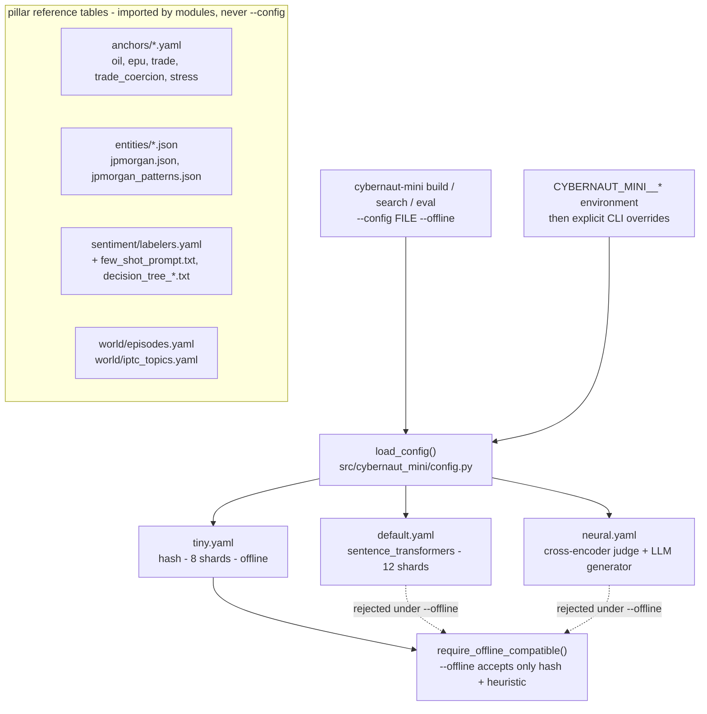

# `configs/` — CLI profiles and pillar reference tables

Blog ref: [the-road-to-cybernaut-1](https://nosible.com/blog/the-road-to-cybernaut-1) —
the three YAML profiles select how much of that eight-stage pipeline is real in a
given run. Local copy:
[`data/00_reference/the-road-to-cybernaut-1.md`](../data/00_reference/the-road-to-cybernaut-1.md).
The `anchors/` and `world/` YAML files name their source post and URL in the header
comment; the sentiment prompts and the JPMorgan JSONs are verbatim copies of the
published artifacts, with byte-equality asserted by tests rather than a header.

This directory is **not** Kedro's `conf/`. Kedro reads `conf/base/` and `conf/prod/`
for catalog and parameters; `configs/` holds the profiles the Typer CLI loads with
`--config <file>`, plus the small reference tables the pillar modules read by a fixed
path. Keeping them separate means a `kedro run` and a `cybernaut-mini build` can pick
different embedding providers without either editing the other's config.

## The three profiles

| File | Embedder | Shards | Agent |
|---|---|---|---|
| `tiny.yaml` | `hash` (dim 256) | 8 | heuristic |
| `default.yaml` | `sentence_transformers` (e5-small) | 12 | heuristic |
| `neural.yaml` | `sentence_transformers`, `device: auto` | 12 | cross-encoder + LLM |

`tiny.yaml` needs no download. The other two need `uv sync --extra st`, plus
`--extra mps` on a Mac for `neural.yaml` to run its models on the GPU.

`--offline` is checked structurally, not trusted to the profile's name:
`AppConfig.require_offline_compatible()` rejects anything whose embedding provider is
not `hash` or whose agent judge/generator is not `heuristic`, because a warm cache is
not something the config can verify. `tiny.yaml` is the profile that passes.



## `anchors/`

Five anchor-phrase files — `oil.yaml`, `epu.yaml`, `trade.yaml`,
`trade_coercion.yaml`, `stress.yaml`. Each carries the post's anchor sentences verbatim
plus a `thresholds:` block. `cybernaut_mini.world.anchors` globs this directory
(`ANCHOR_DIR = Path("configs/anchors")`) and embeds the phrases; the AND-gate that
consumes them lives in `cybernaut_mini.world.indices.gpr`.

## `entities/`

`jpmorgan.json` is the blog's JPMorgan entity record reproduced field-for-field, and
`jpmorgan_patterns.json` is its distilled pattern list. They are the worked example
`cybernaut_mini.entities.resolver` and `distill` are tested against; tests assert the
record's fields match the post's schema rather than a re-typed paraphrase.

## `sentiment/`

`labelers.yaml` defines the labeler pool (TextBlob/VADER threshold sweeps by default;
Flair, FinBERT and LLM labelers opt-in), the benchmark reference column, the ensemble
bootstrap settings and the distillation survey checkpoints. The four text files —
`few_shot_prompt.txt`, `oracle_adjudication.txt` and the three
`decision_tree_*.txt` prompts — are copied verbatim from the posts and asserted
byte-identical to the constants in `cybernaut_mini.sentiment.labelers` and
`cybernaut_mini.sentiment.prompts`.

## `world/`

`episodes.yaml` is the named trade-policy episode table (Section 232 → August 2019
escalation) that `cybernaut_mini.world.validate` aligns monthly index ranks against.
`iptc_topics.yaml` is the IPTC-Media-Topics subset — the 17 level-1 labels plus the
level-2/3 codes the geopolitical filter matches exactly.

## How to use it

```bash
# Offline fixture build: no downloads, 8 hash shards.
cybernaut-mini build --input data/01_raw/fixtures/documents.jsonl \
  --index artifacts/fixture --config configs/tiny.yaml --offline

# Quality profile: real e5-small embeddings (install `uv sync --extra st` first).
cybernaut-mini search --index artifacts/fixture --mode hybrid \
  --config configs/default.yaml --question "..."

# Full neural agent: cross-encoder judge + Qwen generator on MPS.
cybernaut-mini search --index artifacts/fixture --mode agent \
  --config configs/neural.yaml --question "..." --trace-out run.json
```

Any field can be overridden without editing a file, e.g.
`CYBERNAUT_MINI__INDEX__N_SHARDS=4` or `CYBERNAUT_MINI__EMBEDDING__PROVIDER=hash`.
Precedence is CLI overrides > environment > YAML > model defaults.
