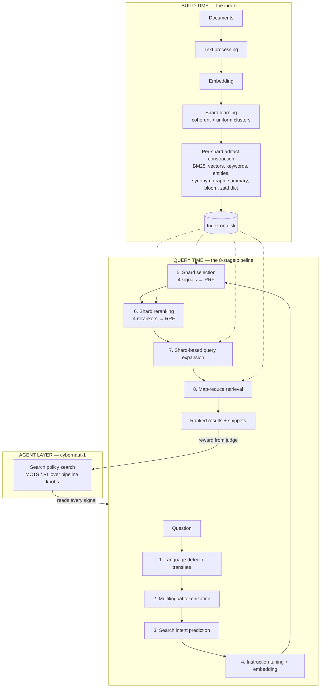

# Build Guide: Technical Components of the Cybernaut-1 Retrieval Stack

This is an implementation outline of every technical component described in
[The Road to Cybernaut-1](./the-road-to-cybernaut-1.md), reorganised from
"here is how NOSIBLE works" into "here is what to build, in what order, and how to
know it works."

Each component gets: **what it is → inputs/outputs → algorithm → data structures →
library options → acceptance criteria → failure modes.** Where the component already
exists in this repository, the file is named; where it does not, it is marked
**NOT BUILT**.

> **Scale disclaimer.** The blog describes a production system with 250,000 shards and
> ~1B webpages. Nothing here requires that scale. Every component below is
> scale-invariant in *design*; the guide notes where an implementation choice only
> matters above ~10k shards, so a 12-shard local build can skip it deliberately rather
> than accidentally.

---

## 0. Architecture at a Glance

The system is two halves joined by an artifact on disk:



The single most important architectural claim in the post: **the agent is given the
internals, not just the results.** Everything in the query pipeline must therefore emit
a structured trace, not just a ranked list. Build tracing in from the first commit — it
is not an observability nice-to-have, it is the agent's sensor array.

---

## Part A — Build-Time Components (the shard)

### A1. The shard as the unit of everything

**What it is.** A shard is a self-contained, independently deployable mini search
engine over a semantically and lexically coherent subset of the corpus. Not a hash
partition — a *magnet* that attracts similar text.

**Why it matters.** Coherence is what makes the downstream tricks legal:
- Synonym expansion is unambiguous inside a coherent shard ("gene" cannot mean Gene
  Wilder in the CRISPR shard).
- A shard summary is a meaningful routing target for a dense vector.
- Compression dictionaries and bloom filters become discriminative.

**Uniformity** is a separate requirement from coherence: approximately equal shard
sizes make queries-per-second-per-shard predictable, which is a *serving* property.
Two objectives, one clustering algorithm.

**Build it as.** A clustering routine over document embeddings with a size constraint.
Options, cheapest first:
1. K-means with balanced assignment (capacity-constrained assignment / auction
   algorithm) — good default.
2. Agglomerative clustering with a size cap and a merge/split repair pass.
3. Recursive bisection until every leaf is under a size ceiling.

**Acceptance criteria.**
- Every shard's document count lies within a configured band of the mean (e.g. ±50%).
- Intra-shard mean cosine > inter-shard mean cosine by a clear margin.
- Clustering is deterministic given a seed.

**Failure modes.** One giant shard plus a long tail of singletons (unconstrained
k-means on skewed data); shards that are size-uniform but semantically incoherent
(constraint dominating the objective). Measure both, not one.

*Repo status:* built — `src/cybernaut_mini/sharding.py` (`shard_documents`,
`ShardingResult`).

### A2. Shard artifacts

The blog enumerates what lives inside a shard. Treat this as the build checklist. Each
row is an independent, testable component.

| Artifact | Purpose | Build approach | Repo status |
|---|---|---|---|
| **Metadata** | Descriptions, classifications for filtering/display | Structured record per shard | Built (`ShardManifest` in `models.py`) |
| **Full-text index** | Longer n-gram / phrase retrieval | Aho-Corasick automaton or suffix structure over raw text | **NOT BUILT** |
| **Lexical index (BM25)** | Keyword retrieval | `rank-bm25`, or Tantivy/Lucene at scale | Built (`indexing.py`) |
| **Semantic index** | Vector retrieval | Flat matrix at small scale; HNSW (USearch/FAISS) above ~100k vectors/shard | Built, flat (`retrieval.py`) |
| **Vocabulary** | Unique terms in shard | Set built during tokenization | Built (implicit in BM25) |
| **Keywords** | Terms characteristic of *this* shard | TF-IDF/BM25 weight of term in shard vs. corpus; keep top-N | Built (`compute_keywords`) |
| **Entities** | Salient named entities + counts | NER pass, aggregate counts per shard | Built (`compute_entities`) |
| **Synonyms** | Co-occurrence graph for expansion | Sliding-window co-occurrence → PMI/count-weighted graph, prune by min edge count | Built (`compute_term_graph`) |
| **Classifiers** | Signals (sentiment, brand safety, industry) | Fine-tuned small transformer per signal | **NOT BUILT** |
| **Compressors** | Trained compression dictionary | Zstandard dictionary trained on shard text (`zstd --train`) | Partial — `routing.py` uses generic zlib, no trained dict |
| **Bloom filters** | O(1) "does this phrase exist here?" | Bloom filter over shard phrases/n-grams | **NOT BUILT** — approximated by keyword+graph coverage |
| **Queries** | Example queries aligned to shard | LLM-generated from shard content; used for routing + eval | **NOT BUILT** |
| **Evals** | Gold-standard set per shard | Query→relevant-doc judgments | Partial — global judgments only (`data/sample/judgments.jsonl`) |
| **Rerankers** | Fine-tuned neural reranking | Cross-encoder (`bge-reranker-v2-m3` class) | **NOT BUILT** |
| **Write-ahead log** | Pending mutations before compaction | Append-only log + periodic merge into the shard | **NOT BUILT** |

**Design rule that makes this list tractable:** every artifact is *derived* and
*rebuildable* from documents + config + seed. Never hand-edit a shard artifact. The
index directory should be reproducible byte-for-byte from `(corpus, config, seed)`.

**Acceptance criteria for the index as a whole.**
- Rebuild with the same inputs → identical serialized index (canonical JSON, sorted
  keys, rounded floats).
- Index carries the embedding-provider identity and dimension; loading with a
  mismatched provider raises a clear error rather than silently producing garbage
  scores.

*Repo status:* the reproducibility contract is implemented — `models.canonical_dumps`,
`IndexMeta`, `IndexLoadError`, `provider_from_meta`.

### A3. LLM-generated shard summaries and titles

**What it is.** Each shard gets a natural-language title and a paragraph-length
description of its content (see shard 11,343 in the post).

**Why it matters.** The summary is the *routing target* for dense shard selection
(stage 5) and the input to the compression and neural rerankers (stage 6). Routing
quality is bounded by summary quality.

**Build approach.** Sample representative documents per shard (nearest-to-centroid plus
a diversity sample), prompt an LLM for a title + description + classifications. Cache
by shard content hash so summaries are not regenerated on every build.

**Acceptance criteria.** Summary mentions the shard's top keywords; embedding of the
summary is closer to that shard's centroid than to any other shard's centroid.

*Repo status:* built but heuristic — `indexing._shard_summary` / `_shard_title` derive
from keywords rather than an LLM. This is the single highest-leverage upgrade for
routing quality.

---

## Part B — The Eight-Stage Query Pipeline

Build these as **independently testable pure functions** with explicit inputs and
outputs. The agent layer (Part C) needs to invoke, inspect, and re-parameterise each
one, which is impossible if they are fused into a single `search()` blob.

### Stage 1 — Language Detection and Translation

**Contract.** `(question, requested_language) → (question_in_target_language, detected_language, confidence)`

**Why it exists.** Multilingual embedding models still have a language gap; text
retrieved in the wrong language embeds into the wrong neighbourhood.

**Algorithm.**
1. Detect language of question and each expansion.
2. If detected ≠ requested, translate.
3. Carry both original and translated text forward — the trace needs both.

**Libraries.** `fasttext-langdetect` (170+ languages, fast, no network) for detection;
a small instruction-following LLM (the post uses `gemma-3n-e4b-it`) for translation.

**Acceptance criteria.** Detection accuracy on a held-out multilingual set; a
same-language request is a strict no-op (byte-identical passthrough); translation is
cached by `(text, target_lang)`.

**Failure modes.** Short queries and code-mixed text detect unreliably — gate on
confidence and fall back to passthrough rather than mistranslating. Translation adds
latency on the critical path; cache aggressively.

*Repo status:* **NOT BUILT**. The repo is English-path only.

### Stage 2 — Multilingual Tokenization

**Contract.** `(text, language) → tokens[]` plus sentence boundaries.

**What it involves.** Sentence boundary detection, text segmentation, Unicode
normalization (NFKC), inflection handling, stemming, stop-word removal.

**The actual engineering problem** is not any single step — it is that every language
needs a different library, and you need one interface over all of them. The post is
explicit that they wrapped "a dozen or more" NLP packages behind a standardized
interface.

**Build approach.**
```
TextProcessor(language) -> {
    tokenize(text) -> tokens[]
    content_tokens(text) -> tokens[]   # stop-words and function words removed
    entities(text) -> entities[]
    sentences(text) -> spans[]
}
```
Register a per-language backend; fall back to a regex/Snowball path for unsupported
languages. The interface must be identical across backends so no downstream stage
branches on language.

**Libraries by language.** spaCy (75 langs), NLTK (~50), BlingFire (English, very
fast), pySBD (22), PyStemmer (24), indic-nlp-library, pymorphy3 (ru/uk), jieba (zh),
mecab-python3 + ipadic (ja), mecab-ko (ko), wtpsplit (85, slow), inflect (en).

**Critical invariant.** The *same* tokenizer configuration must be used at build time
and query time. A tokenizer change silently invalidates every BM25 index. Record the
tokenizer identity in the index metadata and validate on load.

**Why not "just use an LLM."** The post answers this directly: (1) even small LLMs are
too slow for this stage, and (2) semantic search is not a silver bullet — well-calibrated
lexical indices *beat* well-calibrated semantic indices on AI queries more often than
not, because AI queries are long and high-intent. Hybrid beats both. Do not skip the
lexical path.

**Acceptance criteria.** Golden token lists per language; round-trip stability;
identical output across processes and runs.

*Repo status:* built for English — `text.py` (`TextProcessor`, spaCy with regex
fallback, `normalize`, `lexical_form`). The multi-backend registry is the extension
point.

### Stage 3 — Search Intent Prediction

**Contract.** `(tokens, tfidf_scores, pos_tags) → intent_phrases[]`

**Definition from the post.** A search intent is *a sequence of proximal tokens with a
high harmonic TF-IDF score that does not contain excluded parts of speech* (pronouns,
determiners, conjunctions, adverbs).

**Algorithm.**
1. Compute TF-IDF per token against the corpus.
2. Enumerate contiguous n-gram windows (n = 2..4) over the token sequence.
3. Reject any window containing an excluded POS tag.
4. Score each window by the **harmonic mean** of its tokens' TF-IDF scores.
5. Keep windows above a threshold; deduplicate nested spans by score.

**Why harmonic mean specifically.** It is dominated by the smallest value, so a phrase
containing one low-information token scores badly. Arithmetic mean would let "safer
gene the" survive on the strength of "gene". This is the whole trick — implement it as
harmonic, not as a convenience average.

Worked example from the post: *"What lessons from bacteria and yeast actually translate
into safer gene-editing medicines?"* → `editing medicine`, `gene-editing`,
`gene-editing medicine`, `safer gene`, `safer gene-editing`, `safer gene-editing medicine`.

**Consumers.** Intents feed the bloom-filter reranker (stage 6) and the final full-text
phrase pass (stage 8). Building intents without those two consumers gains nothing —
schedule them together.

**Libraries.** NumPy, spaCy (POS tagging).

**Acceptance criteria.** Reproduce the worked example above from the post's query.
Intents never contain stop-words. Intent count is bounded (cap it — this feeds a
quadratic-ish downstream pass).

*Repo status:* **NOT BUILT as specified.** `routing.py` uses raw bigram coverage as a
proxy. Upgrading to harmonic-TF-IDF POS-filtered intents is a contained, high-value
change.

### Stage 4 — Instruction Tuning and Embedding

**Contract.** `(question, expansions, instruction_template, context) → query_vectors`

**What it is.** Instruction-tuned embedding models (the post uses
`multilingual-e5-large-instruct`) align vectors with a natural-language instruction
prepended to the text. The instruction is a *tunable parameter*, not a constant.

**The template from the post:**
> "Given a question, please retrieve any relevant {Language} Headlines, Leads, Passages,
> and Source URLs that focus on the same named entities as the question, and provide
> substantive answers to the question."

Templates carry placeholders for language, named entities, geographic regions, and
topics. The post reports **1–5% free precision/recall improvement** from optimizing the
instruction, or from having a small LLM write a bespoke one per query.

**Build approach.**
1. A template registry with named templates and typed placeholders.
2. A renderer that fills placeholders from query analysis (entities from stage 2,
   language from stage 1, topics from routed shards).
3. Offline: an LLM-driven evolutionary loop that mutates templates and scores them on
   the eval set (this is how the post's best template was found).
4. Expose `instruction_template` as an agent-tunable knob (Part C).

**Non-negotiable invariant.** Documents and queries must be embedded with the
*asymmetric* convention the model was trained on (E5: `passage: ` vs `query: `). Getting
this backwards degrades results subtly rather than obviously.

**Acceptance criteria.** Vectors are L2-normalized (so dot product == cosine).
Provider identity + dimension recorded in index metadata. Swapping templates changes
results measurably on the eval set.

*Repo status:* partially built — `providers/embeddings.py` applies E5 `query: `/
`passage: ` prefixes and L2-normalizes; `HashEmbedder` gives a deterministic offline
path. The instruction *template system* is **NOT BUILT**.

### Stage 5 — Shard Selection (Routing)

**Contract.** `(query_vector, query_tokens, query_entities, index) → (ranked_shard_ids, signals)`

**This is the most important stage in the pipeline.** Route to the wrong shards and no
amount of downstream quality recovers the right document — it was never a candidate.

**Four ranking factors, then RRF:**

1. **Vanilla dense similarity** — cosine between the query embedding and the embedding
   of each shard's LLM summary. Above ~10k shards, back this with an ANN index (HNSW
   via USearch/FAISS) rather than a full scan.
2. **Bayesian dense similarity** — the post's patent-pending selector; treat as an
   unspecified slot. A reasonable open stand-in: score shards by posterior probability
   under a per-shard distribution over embeddings (centroid + covariance / vMF), which
   accounts for shard *spread* rather than centroid distance alone.
3. **Vanilla sparse similarity** — sparse TF-IDF cosine between query keywords and
   shard keywords. One large sparse matrix (`scipy.sparse`), one matrix-vector product.
4. **Entity sparse similarity** — same, over entities, and *only computed when the
   query contains entities*. Skipping it entirely is correct when it does not apply;
   including a degenerate all-zero list corrupts the fusion.

**Fusion.** Reciprocal Rank Fusion combines the ranked lists. RRF is rank-based, not
score-based, so it needs no score calibration across heterogeneous signals and degrades
gracefully when one signal is noisy:

```
score(d) = Σ_over_lists  weight_L / (k + rank_L(d))       # k ≈ 60
```

Implement RRF once, as a shared primitive — it is used here *and* in stage 6 *and* in
stage 8. Per-list weights and `k` must be config-driven, because they are agent-tunable
knobs.

**Output contract.** Return top-N shards (the post routes to ~100, then narrows to
10–30 for retrieval) **plus a signals object carrying every per-shard component score.**
The agent cannot reason about routing it cannot see.

**Libraries.** NumPy, SciPy (sparse), Numba, SimSIMD (fast distance kernels), USearch (ANN).

**Acceptance criteria.** For each eval query, the shard containing the gold document
appears in the top-N. Track `shard_recall@N` as a first-class metric, separately from
end-to-end nDCG — it isolates routing failure from retrieval failure.

**Known weakness (acknowledged in the post).** Very short queries route poorly. This is
an accepted trade-off: the engine is built for AI queries, which are long and
unambiguous. Do not over-engineer for two-word queries.

*Repo status:* built — `routing.py::route` implements dense + sparse + conditional
entity signals fused via `rrf.py::rrf_fuse`, returning `RoutingSignals`. Missing: the
Bayesian selector and ANN acceleration (unnecessary at 12 shards).

### Stage 6 — Shard Reranking

**Contract.** `(question, intents, candidate_shard_ids, index) → (reranked_shard_ids, signals)`

**Why it exists.** The post shows selection returning genuinely bad shards for the
Japanese query — quantum computing, data protection, digital platforms — and reranking
pulling the correct pharmaceutical shard to the top. Selection is recall-oriented over
all shards; reranking is precision-oriented over ~100 candidates. Different jobs.

**Four rerankers:**

1. **Bloom filter reranker.** Each shard holds a bloom filter of important phrases. If a
   shard contains none of the query's search intents, downrank it. Cost is O(1) per
   probe — this is the cheapest possible relevance signal and should run first.
   *Requires stage 3 intents and the A2 bloom filter artifact.*
2. **Compression reranker.** Each shard has a trained Zstandard dictionary. Compress the
   question against each dictionary; the shard that compresses it best most likely
   contains similar content. Elegant because it needs no model inference — compression
   ratio *is* a similarity measure (cf. normalized compression distance).
3. **Neural reranker.** Feed `(question, shard_title + summary)` to a cross-encoder
   (`bge-reranker-v2-m3`). Most accurate, most expensive; apply to the top slice only.
4. **Page (re)ranker.** Build a nearest-neighbour graph over shards and run
   Personalized PageRank seeded on the selected shards, producing a probability mass
   over them. This is the only reranker that uses shard-to-shard *structure* rather than
   query-to-shard similarity — it surfaces neighbours of strong matches.

Fuse all four with RRF (same primitive as stage 5).

**Explicit anti-pattern from the post.** LLM-based shard reranking works very well but
its latency is unacceptable for a search engine. Build the cheap rerankers. Note that
the agent layer (Part C) can afford LLM-quality judgments precisely because it operates
on a *different latency budget* — that is the architectural split.

**Libraries.** Zstandard (`zstd`, with dictionary training), `rBloom`, HuggingFace
cross-encoders, NetworkX or a hand-rolled sparse PPR.

**Acceptance criteria.** On queries where selection put the gold shard outside the top-3,
reranking moves it in. Measure `shard_recall@k` before and after — if reranking does not
improve it, one of the rerankers is miscalibrated and is adding noise through RRF.

*Repo status:* two of four built — `routing.py` implements an intent-coverage reranker
(bigram/term-graph proxy for the bloom filter) and a compression reranker using generic
`zlib` rather than trained zstd dictionaries. Neural reranker and Personalized PageRank
are **NOT BUILT**.

### Stage 7 — Shard-Based Question Expansion

**Contract.** `(query_tokens, selected_shard_ids, index) → expanded_tokens[]`

**The key insight.** Expansion uses the synonym graph *of the selected shards*, not a
global thesaurus. Because each shard is lexically coherent, its co-occurrence
neighbourhoods are unambiguous — "gene" in the CRISPR shard has only the genetic sense.
This is why sharding-for-coherence pays off twice: once in routing, once here.

**Algorithm.**
1. For each query token, look up neighbours in the selected shards' co-occurrence graphs.
2. Weight candidates by edge strength (co-occurrence count or PMI) and by the rank of the
   shard they came from.
3. Sample or take top-N, capped by `max_expansions`.
4. **Downweight expansions relative to original terms** at scoring time.

**The calibration warning from the post.** Expansion introduces noise and serendipity;
be careful not to overwhelm the original search words. Implement this as an explicit
weight (the repo uses `0.3 × expansion_bm25_score`), not as an emergent property. Make
the weight a config knob and an agent-tunable action.

Worked example: 9 original tokens → +21 expansions including `bacteriophag`, `crispr`,
`prokaryot`, `phage`, `archaea` — and also `raffinos`, `biofuel`, `acronym`, which is
exactly the noise the downweighting exists to contain.

**Acceptance criteria.** Expansions are deterministic given `(query, shards, seed)`.
Recall improves on the eval set; precision does not collapse. Expansion count respects
the cap.

*Repo status:* built — `expansion.py::expand_query` over `ShardManifest.term_graph`,
with expansion-term downweighting applied in `retrieval.py::search_shard`.

### Stage 8 — Retrieval Using Map-Reduce

**Contract.** `(query_vectors, expanded_tokens, intents, shard_ids, sql_filter, top_k) → ranked_hits[]`

**Map phase — broadcast the query package to each selected shard.** Each shard
independently:
1. Applies the user's SQL/metadata filter to eliminate documents.
2. Runs full lexical search (BM25 + downweighted expansions) over survivors.
3. Runs full semantic search (cosine) over survivors.
4. Fuses lexical and semantic with RRF — *within the shard*.
5. Runs a full-text phrase pass over the top results, matching search intents.

Filter first. Filtering after scoring wastes the majority of the compute on documents
that were never eligible.

**Reduce phase.** Combine per-shard results grouped by document id. Two distinct
aggregations, which must not be conflated:
- Across **shards** for one query variant: take the *best* score (the same document may
  live in only one shard, but variants may hit different shards).
- Across **query variants** (original + expansions + rewrites): *sum* the per-variant
  best scores, so documents found by multiple formulations rank higher.

**Snippet construction.** For each result, build a highly relevant snippet — locate the
densest window of query/intent terms, trim to word or sentence boundaries, respect a
caller-specified maximum length. Snippets are the actual product surface for an AI
consumer; treat them as a first-class component, not a substring call.

**Libraries.** Polars (columnar filtering/grouping), NumPy, Numba, SimSIMD,
`ahocorasick-rs` (multi-pattern phrase matching for the intent pass).

**Acceptance criteria.** Per-shard search is a pure function of `(shard, query package)`
— which makes it trivially parallelisable and independently testable. `mode` ∈
`{lexical, dense, hybrid}` is selectable so each path can be evaluated in isolation.
Hybrid beats both single-mode baselines on the eval set; if it does not, the RRF weights
are wrong.

*Repo status:* built — `retrieval.py` (`search_shard`, `merge_shard_results`,
`retrieve`, `make_snippet`, `_trim_to_word_boundary`), with `MetadataFilter` standing in
for the SQL filter.

---

## Part C — The Agent Layer (cybernaut-1)

### C1. The core thesis

> "Other agentic searchers, by comparison, are flying blind. They only see the top search
> results. They don't know how they got there. So, their ability to reflect and iterate is
> fundamentally constrained. It's just a random walk."

Cybernaut-1 has unrestricted access to every shard, algorithm, selector, reranker, and
signal, and can tune them on the fly. It is described as **a reinforcement learner that
designs and iterates on search policies to maximize search relevancy** — and, per the
companion post, uses **MCTS**.

The engineering consequence is a hard requirement on Part B: **every stage must expose
its parameters as data and emit its intermediate signals in the trace.** An agent that
can only re-issue query strings is the random walk this design exists to escape.

### C2. Component: the state

A search state is the full parameterisation of one pipeline execution:

```
SearchState = {
    query: str
    expansions: tuple[str, ...]
    shard_ids: tuple[int, ...]
    lexical_weight: float
    dense_weight: float
    metadata_filter: Filter | None
    instruction_template: str
    stage: Stage
}
```

States must be **immutable and hashable** — `evolve(**changes)` returns a new state.
Hashability gives free memoization of identical retrievals, which matters because the
retrieval budget is the binding constraint.

*Repo status:* built — `agent/state.py` (`SearchState`, `Stage`, `StateSummary`).

### C3. Component: the action space

Actions are typed transformations of state, each corresponding to a knob in Part B:

| Action | Tunes | Pipeline stage |
|---|---|---|
| `RewriteQuery` | The question itself | 1–4 |
| `AddExpansions` | Expansion term set | 7 |
| `NarrowShards` | Routed shard subset | 5–6 |
| `AdjustHybridWeights` | lexical/dense RRF weights | 8 |
| `RetainFilter` | Metadata/SQL filter | 8 |

Keep the action set small, typed, and closed. An open-ended "do anything" action space
makes credit assignment impossible and the search unreproducible. Every action must
serialize to a payload for the trace.

Natural extensions, each unlocked by a Part B component: `SetInstructionTemplate`
(stage 4), `AdjustRoutingWeights` (stage 5), `ToggleReranker` (stage 6),
`SetExpansionWeight` (stage 7).

*Repo status:* built — `agent/actions.py`.

### C4. Component: the search algorithm (MCTS)

Standard MCTS adapted to retrieval:

- **Node** = a search state + visit count + accumulated value.
- **Selection** = UCT: `mean_value + c · sqrt(ln(parent_visits) / visits)`, with
  deterministic tie-breaking (this matters more than it sounds — ties are common early
  and non-deterministic tie-breaks destroy reproducibility).
- **Expansion** = apply an action to produce a child state.
- **Simulation** = execute the pipeline for that state and score the results.
- **Backpropagation** = push the reward up the path to the root.

A staged variant works well and is what this repo implements: **generate candidates →
refine survivors → exploit the best**, with beam-style survivor selection between
stages, rather than a flat iteration loop. It bounds the tree explicitly.

**The binding constraint is the retrieval/embedding budget, not tree depth.** Wrap the
embedding provider in a counting proxy and check the budget before every rollout.
Budget exhaustion must terminate cleanly with the best result so far, never raise.

*Repo status:* built — `agent/node.py` (`SearchNode`, `uct_score`, `select_child`,
`backpropagate`), `agent/search.py` (`SearchAgent`, `Counters`, `_CountingProvider`,
`_run_candidates` / `_run_refine` / `_run_exploit`).

### C5. Component: the reward signal (judge)

**Contract.** `(question, results) → score ∈ [0, 1]`

This is the component that determines whether the whole agent works. Options, in
increasing cost:
1. **Heuristic** — term overlap, rank-weighted coverage of query/intent terms, result
   diversity. Free, deterministic, offline-capable, and a good regression baseline.
2. **Cross-encoder relevance** — score each `(query, passage)` pair with a reranker model,
   aggregate rank-weighted.
3. **LLM judge** — prompt a model for graded relevance. Best correlation with human
   judgment, highest cost and variance. Cache by `(query, doc_id)`.

Define it behind a `Judge` protocol so all three are swappable and the offline path
never requires a network call.

**Reward shaping.** The reward should combine result quality with a penalty for cost
(retrievals consumed), otherwise the agent learns to burn the entire budget on
marginal gains.

*Repo status:* built — `providers/judge.py` (`Judge` protocol, `HeuristicJudge`),
`agent/policy.py::compute_reward`. LLM and cross-encoder judges are **NOT BUILT**.

### C6. Component: the query generator

**Contract.** `(question, shard_context) → candidate_queries[]`

Generates the alternative formulations the agent explores. Heuristic version: recombine
query tokens with high-value shard keywords not already present in the query. LLM
version: prompt for N diverse reformulations conditioned on the routed shards' summaries
— which is the "few-shot search" capability the post calls out as uniquely valuable for
AI consumers (AIs can effortlessly generate multiple queries, so multi-query input is
worth more to them than to humans).

*Repo status:* built, heuristic — `providers/query_generator.py`. LLM generator **NOT BUILT**.

### C7. Component: the trace

Not optional, and not logging. The trace is the agent's perception of the engine and the
user's explanation of the result. It must record, per rollout: the state, the action that
produced it, all routing signals, all reranker scores, per-hit RRF contributions and
component ranks, the judge score, and the budget consumed.

Requirements: canonical JSON serialization (sorted keys, rounded floats) so traces
diff cleanly across runs, and a `replay` path that reconstructs a run from its trace
without re-executing retrieval.

*Repo status:* built — `trace.py`, `agent/search.py::SearchAgent.replay`.

---

## Part D — Cross-Cutting Components

### D1. Evaluation harness

Nothing above can be tuned without this, and it should be built *before* stages 5–8, not
after.

- **Metrics:** nDCG@k (graded relevance), Recall@k, MRR@k — plus `shard_recall@N` as a
  routing-specific metric that isolates stage 5/6 failure from stage 8 failure.
- **Per-mode breakdown:** evaluate `lexical`, `dense`, and `hybrid` separately. The claim
  "hybrid dominates both" is the system's central empirical bet — verify it on your own
  corpus rather than inheriting it.
- **Per-shard gold sets:** the post lists Evals as a *shard artifact*. Per-shard eval sets
  let you find the specific shards that are badly built.
- **Judgments format:** `(query_id, doc_id, relevance_grade)` in JSONL.

*Repo status:* built — `evals.py` (`ndcg_at_k`, `recall_at_k`, `mrr_at_k`, `ModeMetrics`,
`evaluate`), `data/sample/judgments.jsonl`.

### D2. Determinism and reproducibility

A search stack has many places for nondeterminism to enter: dict iteration order, ties in
sorting, float accumulation order, model nondeterminism, thread scheduling. Every one of
them makes the eval harness lie to you.

Rules:
- Seed everything; pass the seed through config.
- Break every sort tie explicitly and deterministically (by id).
- Canonicalize serialized floats.
- Provide an **offline provider** (deterministic hash embedder) so the full pipeline and
  test suite run with no network.

*Repo status:* built — `models.canonical_dumps`, `HashEmbedder`,
`AppConfig.require_offline_compatible`, deterministic tie-breaks throughout
(`_tie_key` in `agent/node.py`, `action_sort_key` in `agent/actions.py`).

### D3. Configuration

Every knob named in Parts B and C must be config-addressable and overridable, because
the agent tunes them and the eval harness sweeps them. Layer: defaults → YAML file →
environment → CLI flags. Validate with a schema and fail loudly on unknown keys.

*Repo status:* built — `config.py` (`AppConfig`, `EmbeddingConfig`, `IndexConfig`,
`RRFConfig`, `AgentConfig`), `configs/default.yaml`, `configs/tiny.yaml`.

### D4. Prompt injection defence

The post makes this a design principle in its first section: AIs do not need
spell-checking, and those CPU cycles are better spent detecting threats like prompt
injection. Retrieved web content is untrusted input flowing directly into an agent's
context.

Minimum viable component: a classifier or rule pass over retrieved snippets that flags
imperative instruction patterns, and delimiting/escaping of retrieved content when it is
placed into any LLM prompt (the judge and query generator both do this).

*Repo status:* **NOT BUILT**.

---

## Part E — Build Order

Each milestone is independently verifiable. Do not start a milestone before the previous
one's acceptance criteria pass.

| # | Milestone | Components | Done when |
|---|---|---|---|
| 1 | Foundations | Config, models, canonical serialization, offline embedder | Round-trip serialization is byte-stable |
| 2 | Text processing | Tokenizer interface, English backend | Golden token tests pass |
| 3 | Index build | Sharding, BM25, vectors, keywords, entities, term graph, summaries | Rebuild is byte-identical |
| 4 | **Eval harness** | Metrics, judgments, per-mode breakdown | Baseline numbers recorded for all three modes |
| 5 | Retrieval | Per-shard hybrid search, RRF, map-reduce merge, snippets | Hybrid > lexical and > dense on the eval set |
| 6 | Routing | 4 selection signals + RRF + rerankers | `shard_recall@N` beats a random-routing baseline |
| 7 | Expansion | Shard-graph expansion with downweighting | Recall improves, precision holds |
| 8 | Trace | Structured signals from every stage + replay | A run reconstructs from its trace alone |
| 9 | Agent | State, actions, MCTS, judge, reward, budget | Agent beats single-shot retrieval on nDCG within budget |
| 10 | Multilingual | Language detection, translation, per-language backends | Non-English eval set passes |
| 11 | Scale-out | ANN/HNSW routing, trained zstd dicts, bloom filters, neural reranker, PPR | Latency holds as shard count grows |
| 12 | Hardening | Prompt-injection detection, write-ahead log, per-shard classifiers | Adversarial corpus test passes |

Milestone 4 before 5 is the load-bearing ordering decision in this list. Building
retrieval before you can measure it means tuning by vibes, and every subsequent
milestone compounds the error.

---

## Part F — Status Summary for This Repository

**Built:** sharding, BM25 + dense indexing, keywords/entities/term-graph, heuristic shard
summaries, RRF primitive, 3-signal routing with 2 rerankers, shard-graph expansion,
hybrid per-shard retrieval, map-reduce merge, snippets, metadata filtering, eval harness
(nDCG/Recall/MRR per mode), full trace + replay, MCTS agent with typed actions,
heuristic judge and query generator, budget accounting, deterministic offline path,
layered config, CLI (`build`, `search`, `eval`, `inspect-shards`).

**Highest-value gaps, in recommended order:**

1. **LLM shard summaries** (A3) — routing quality is bounded by summary quality, and
   everything downstream inherits that bound.
2. **Search intent prediction** (Stage 3) — harmonic TF-IDF with POS filtering, replacing
   the current raw-bigram proxy. Unlocks the bloom reranker and the full-text intent pass.
3. **Instruction template system** (Stage 4) — the post reports 1–5% precision/recall for
   what is essentially prompt engineering on the embedder.
4. **Trained zstd dictionaries** (Stage 6) — replaces generic zlib; makes the compression
   reranker actually discriminative.
5. **Bloom filters + full-text intent pass** (A2, Stage 8) — cheap, high-precision signal.
6. **LLM/cross-encoder judge** (C5) — better reward signal directly improves everything
   the agent learns.
7. **Multilingual path** (Stages 1–2) — largest scope, currently English-only.
8. **Neural reranker and Personalized PageRank** (Stage 6).
9. **Prompt-injection defence** (D4).

**Deliberately out of scope at this scale:** ANN indexes (12 shards scan trivially), the
write-ahead log (rebuild is cheap), per-shard LoRAs and small LLMs, per-shard classifiers,
250k-shard training runs.

---

## Appendix — The Design Principles Behind the Trade-offs

These are the "why" behind the components. When an implementation decision is ambiguous,
resolve it against these.

1. **The end user is an AI, not a person.** Every trade-off follows from this. No spell
   checking; no personalization; long unambiguous queries assumed; multi-query input is
   a first-class feature.
2. **Recall over precision.** People have short attention spans; AIs have massive context
   windows. Return 100 results, not 10.
3. **Genius-friendly, not idiot-proof.** Expose complexity — SQL filters, per-signal
   weights, raw scores. The consumer is a SQL expert who speaks 200 languages.
4. **Hybrid dominates.** Well-calibrated lexical beats well-calibrated semantic on AI
   queries more often than not; hybrid beats both. Never ship semantic-only.
5. **Coherence enables everything.** Semantically coherent shards are what make
   unambiguous expansion, meaningful summaries, and discriminative compression possible.
   Uniformity is the separate, serving-side constraint.
6. **RRF everywhere.** Rank-based fusion needs no score calibration and tolerates one
   noisy signal. It appears at three levels: signals→shards, rerankers→shards,
   lexical+dense→documents.
7. **Latency budgets differ by layer.** The pipeline cannot afford LLM reranking; the
   agent can afford LLM judgment. Put expensive intelligence in the outer loop.
8. **Surface the machine to the agent.** High trust, full introspection. Everything else
   is a random walk.
