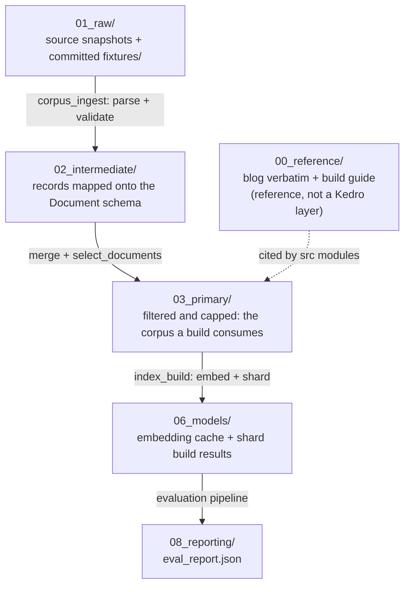

# `data/` — the Kedro data layers, the committed fixture, and the blog reference

Blog ref: [the-road-to-cybernaut-1](https://nosible.com/blog/the-road-to-cybernaut-1).
The blog itself is committed here verbatim as
[`00_reference/the-road-to-cybernaut-1.md`](00_reference/the-road-to-cybernaut-1.md),
with the repo's step-by-step build guide beside it as
`00_reference/the-road-to-cybernaut-1.build-guide.md`. Every `data/00_reference/*.md`
path cited by a module is validated by `tools/docs_check.py`.

`conf/base/catalog.yml` declares every path in this tree; nothing opens these files
from inside a pipeline node. That is what makes `kedro viz` show real lineage and what
lets `conf/prod` swap a local corpus for a pinned Hugging Face one without a code
change.



Kedro's standard layer numbers are not all used. `04_feature`, `05_model_input` and
`07_model_output` have no directory here: feature computation happens inside the
index-build nodes rather than as a persisted layer, and the index itself is an
`artifacts/<index>/` directory, not a `data/07_model_output/` file.

## `01_raw/` — acquisition

Verbatim source rows, exactly as fetched, plus the one slice that is committed to git.

- `corpus_source.jsonl` / `corpus_snapshot.jsonl` — the generic local source and its
  snapshot. The base-env default so `kedro run --pipeline corpus_ingest` never touches
  the network.
- `ccnews_source.jsonl` / `ccnews_snapshot.jsonl` — CC-News branch.
- `miracl_source.jsonl` / `miracl_snapshot.jsonl` — MIRACL passage branch;
  `miracl_en_dev_docids.txt` lists the en-dev doc ids.
- `ais_snapshot.jsonl` — AIS vessel positions used by the WORLD event pillar.
- `edgar/company_tickers.json` — a real excerpt of the SEC ticker↔CIK file, with
  `edgar/trv.jsonl` for the Travelers worked example.
- `entities/wikipedia/` and `entities/wikidata/` — cached lookups for the JPMorgan
  worked example, so the entity tools run fully offline.
- `.miracl_shard_cache/` — downloaded MIRACL shard bytes, so a rerun does not refetch.

### The committed fixture slice: `01_raw/fixtures/`

Two files, both tracked in git, both derived from real public datasets at pinned
commit SHAs. Downloads and network access are never required to run the tests.

| File | Contents |
|---|---|
| `documents.jsonl` | 460 real documents: 260 MIRACL passages + 200 CC-News articles |
| `judgments.jsonl` | 25 MIRACL en-dev queries with graded qrels (`grade` 0 or 1) |

`cybernaut_mini.datasets.PROTECTED_DIRS` refuses any pipeline write into
`data/01_raw/fixtures/` or `data/00_reference/`, so an acquisition run cannot
overwrite the golden slice. Reads are unaffected: `--input
data/01_raw/fixtures/documents.jsonl` stays the offline path.

## `02_intermediate/` — normalised

Acquired rows mapped onto the `Document` schema, before filtering.
`documents.jsonl`, `ccnews_documents.jsonl`, `miracl_documents.jsonl` and the merged
`merged_documents.jsonl`; `miracl_en_dev_judgments_unvalidated.jsonl` holds parsed
qrels before validation. The `ccnews_miracl_*` files are the two-source merged run.

## `03_primary/` — build-ready

`corpus.jsonl` is the filtered, capped corpus the index build consumes
(`documents` in the catalog). `miracl_en_dev_judgments.jsonl` is the validated qrels
file, and `port_calls.jsonl` is a single derived port-call record (MMSI, position,
dwell hours), kept for the WORLD shipping work.

## `06_models/`

`embed_cache/` holds per-provider embedding caches keyed by provider and revision —
`hash-256-unpinned`, `hash-64-unpinned`, `intfloat-multilingual-e5-small-614241f622f5`.
`ccnews_miracl_shard_result.json` is the persisted shard build result (`labels` and
`centroids`) for the merged CC-News + MIRACL run; it is the `shard_result` entry in
`conf/prod/catalog.yml`.

## `08_reporting/`

The `evaluation` pipeline's output layer. `data/08_reporting/eval_report.json` is
written by the `eval_report` catalog entry; the directory currently holds only
`.gitkeep`, since reports are regenerated on every run.

## Attribution and licence

- [`ATTRIBUTION.md`](ATTRIBUTION.md) — full provenance: dataset cards, pinned commit
  SHAs, the exact subsets used, and BibTeX citations for CC-News and MIRACL.
- [`LICENSE-DATA`](LICENSE-DATA) — the data licence, separate from the code's MIT
  licence. MIRACL is Apache-2.0; its Wikipedia passages are CC BY-SA 3.0; CC-News
  articles carry their original publisher copyright under the Common Crawl Terms of
  Use.

The fixture was generated by `scripts/pull_fixture_slice.py` at the SHAs recorded in
`ATTRIBUTION.md`; rerunning it with the same SHAs reproduces the bytes.

## How to use it

```bash
# Build the offline fixture index straight from the committed slice.
cybernaut-mini build --input data/01_raw/fixtures/documents.jsonl \
  --index artifacts/fixture --config configs/tiny.yaml --offline

# Evaluate against the committed real judgments.
cybernaut-mini eval --index artifacts/fixture \
  --judgments data/01_raw/fixtures/judgments.jsonl --config configs/tiny.yaml --offline

# Acquisition through the catalog (local source by default, Hub under --env prod).
kedro run --pipeline corpus_ingest
```

Do not add a generated file to `00_reference/` or `fixtures/`; both are protected
directories and the write will raise `DatasetError`.
