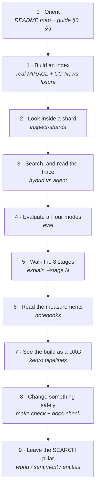

# Learning path

A guided order for reading and running this repository. The
[build guide](REVERSE_ENGINEERING_GUIDE.md) explains *what NOSIBLE disclosed*; this
file is the route through *this codebase*, with the command to run and the thing to
look at once it finishes.

Work through the steps in order. Each one assumes the previous one worked, and each
ends with something you can observe rather than something you have to take on faith.



---

## 0. Orient yourself

**Read.** [`README.md`](../README.md) — the architecture diagram, then the
[repository map](../README.md#repository-map). Then
[`REVERSE_ENGINEERING_GUIDE.md`](REVERSE_ENGINEERING_GUIDE.md) §0 (the stack at a
glance) and §9 (the proposed build order, which this path follows).

**Note the vocabulary.** "Shards" and "collections" are the same construct. "Hybrid-3"
is the 8-stage pipeline. "Cybernaut-1" is the agent layered on top of it. The guide's
§0 defines the recurring primitives — RRF, breadth-weighted attention share,
frozen-embedding geometry, ensemble-then-distil — that show up across unrelated posts.

**Observe.** That the guide tags every step `[disclosed]` or `[inferred]`. That
distinction is the whole point of a clean-room replica, and it is maintained in the
code: `cybernaut-mini explain` reports the same split per stage.

---

## 1. Build an index from real documents

```bash
uv sync
uv run cybernaut-mini build \
  --input data/01_raw/fixtures/documents.jsonl \
  --index artifacts/fixture \
  --config configs/tiny.yaml \
  --offline
```

The fixture slice is real MIRACL passages and CC-News articles with real graded
judgments — not synthetic data ([`data/README.md`](../data/README.md) explains why the
repository forbids that). `configs/tiny.yaml` selects the `hash` embedder, which needs
no download and is byte-deterministic, so this runs offline in seconds.

**Read.** [`REVERSE_ENGINEERING_GUIDE.md`](REVERSE_ENGINEERING_GUIDE.md) §1 steps 1-4
(corpus to shards) and the [artifact formats](../README.md#artifact-formats) section of
the README.

**Observe.** `artifacts/fixture/` contains `_VALID` (written last, so a half-finished
build is never loadable), `index_meta.json` (which records the embedder, shard count
and seed that produced it), the documents and token sidecars, and `shards/`. Rebuild
with the same seed and the JSON artifacts should be byte-identical on this machine —
a per-device guarantee, not a cross-device one, which the README's determinism section
explains.

---

## 2. Look inside a shard

```bash
uv run cybernaut-mini inspect-shards --index artifacts/fixture
```

**Read.** [`REVERSE_ENGINEERING_GUIDE.md`](REVERSE_ENGINEERING_GUIDE.md) §1 "Concrete
numbers" — the production example shard has 134,523 documents and a 64,992-token
vocabulary. Yours will be tiny; the structure is what matters.

**Observe.** Each shard manifest carries its centroid, top-TF-IDF keywords, NER
entities and a co-occurrence term graph. Those fields are exactly the inputs stages 5-7
consume, which is why they are stored per shard rather than recomputed at query time.

---

## 3. Search, and read the trace

```bash
uv run cybernaut-mini search \
  --index artifacts/fixture \
  --question "What percentage of the Earth's atmosphere is oxygen?" \
  --mode hybrid \
  --offline

uv run cybernaut-mini search \
  --index artifacts/fixture \
  --question "What percentage of the Earth's atmosphere is oxygen?" \
  --mode agent \
  --config configs/tiny.yaml \
  --offline \
  --trace-out run.json
```

**Read.** [`REVERSE_ENGINEERING_GUIDE.md`](REVERSE_ENGINEERING_GUIDE.md) §2, and the
[annotated trace example](../README.md#annotated-trace-example) in the README, which
walks the same structure node by node.

**Observe.** In `run.json`: `retrieval_calls` against the 18-call budget, the
per-node `reward_components` (relevance, coverage, dense, lexical, redundancy),
and `judge_reason` on each node. The agent is a **staged beam search with UCT
ordering**, not full MCTS — the README says so plainly, and the trace is where you can
check it. With the default configuration the judge and query generator are heuristics,
so `llm_calls` is 0; `configs/neural.yaml` swaps in a real cross-encoder judge and a
Qwen rewriter if you have the optional extras installed.

---

## 4. Evaluate all four modes

```bash
uv run cybernaut-mini eval \
  --index artifacts/fixture \
  --judgments data/01_raw/fixtures/judgments.jsonl \
  --config configs/tiny.yaml \
  --offline
```

**Observe.** Recall@5/10, MRR@10, nDCG@10, and the retrieval-call cost per mode. Read
the README's discussion of these results rather than the table alone: on a corpus this
small the agent does **not** reliably beat plain lexical retrieval, and the README
explains why (a single BM25 call already finds the top document, so extra routing calls
cost budget without buying quality). This is the most important lesson in the
repository — a more elaborate architecture is not automatically a better one, and the
harness is built to report that even when it is unflattering.

---

## 5. Walk the eight stages

```bash
cybernaut-mini explain              # all eight
cybernaut-mini explain --stage 5    # just shard selection
```

**Read.** [`REVERSE_ENGINEERING_GUIDE.md`](REVERSE_ENGINEERING_GUIDE.md) §1 alongside
it.

**Observe.** Each stage reports what the post disclosed, what this replica had to
decide, and what was rejected. Two are worth pausing on:

- **Stage 5 ships three ranking factors, not four.** The post's Bayesian Dense selector
  is withheld as patent-pending, so it is absent and reported as absent rather than
  guessed at. Selection quality is expected to sit below the post's as a result.
- **Stage 6 fuses rather than cascades**, because a bloom-filter false negative would
  be unrecoverable in a cascade but outvotable in a fusion.

---

## 6. Read the measurements

```bash
make notebooks        # execute all of them headlessly
scripts/lab.sh        # or explore them interactively on :8888
```

**Read.** [`notebooks/README.md`](../notebooks/README.md) — the table of questions and
headline findings — then notebooks `02_shard_anatomy` and `03_retrieval_evaluation`.

**Observe.** Two of the four headline findings are negative and stated plainly: the
shards are coherent but not uniformly sized at eight shards, and hybrid retrieval
scores *below* pure lexical on this corpus. Each notebook reads through the Kedro
catalog rather than opening a data path, which is what lets you point the same notebook
at a different index with one argument changed.

---

## 7. See the build as a DAG

```bash
make pipelines
make viz      # needs `uv sync --extra viz`
```

**Observe.** That only the build and evaluation are Kedro pipelines. Routing, retrieval
and the agent are plain library calls, because they branch dynamically at request time
and share a budget counter — which a static DAG cannot express. The README's
"Kedro vs library boundary" section is the reasoning; this command is the evidence.

---

## 8. Change something safely

```bash
make check        # lint + typecheck + tests
make docs-check   # the documentation contract
```

**Observe.** `make check` runs the same gates CI runs, and `make docs-check` enforces
the contract described in [`AGENTS.md`](../AGENTS.md): every package README carries a
mermaid diagram, and every module states its blog reference, its assumptions and the
alternatives it rejected. The pre-commit hook (`make hooks`) runs the same checker on
staged files, so a module that documents nothing cannot be committed.

Try it: add a module without a docstring and watch the gate refuse it. The checker is
itself tested — `tests/test_docs_check.py` runs it against throwaway repositories that
do and do not violate the contract — so "the gate is green" is a claim with a test
behind it.

---

## 9. Leave the SEARCH pillar

Three subsystems sit beside retrieval, each with its own README:

| Pillar | Start at | Guide |
|---|---|---|
| WORLD: events into point-in-time risk and uncertainty series | [`src/cybernaut_mini/world/README.md`](../src/cybernaut_mini/world/README.md) | §4, §6, §8 |
| Sentiment: labeler pool, benchmark, ensemble-and-distil | [`src/cybernaut_mini/sentiment/README.md`](../src/cybernaut_mini/sentiment/README.md) | §3 |
| Entities: the self-organising faceted-entity loop | [`src/cybernaut_mini/entities/README.md`](../src/cybernaut_mini/entities/README.md) | §7b |

WORLD is the largest and the one the guide calls the real engineering: everything
upstream of retrieval depends on an event layer NOSIBLE never disclosed, so
approximating it (dedup, breadth, dating, topic and country tagging) is where a replica
has to make original decisions. Read §8 before the code.

---

## Where this replica diverges

The [README's comparison table](../README.md#source-described-vs-replica-choices) is
the short version; the guide's `[disclosed]` / `[inferred]` tags are the long one. Two
divergences shape everything else:

1. **Scale.** 250,000 shards against a fixture you can rebuild in seconds. Mechanisms
   are demonstrated; benchmarks are not claimed.
2. **The event layer.** Never disclosed, and upstream of almost every published number.
   Approximating it is the replica's only genuinely original work.

If a number here disagrees with a number in a post, assume the post is right about
NOSIBLE and this repository is right about itself. It claims no benchmark parity, and
[`docs/README.md`](README.md) states the clean-room ground rules.

---

## After the path

- Rebuild at real scale (`make install-prod`, then the `production` pipeline) and
  re-run the notebooks against it. Nothing in them needs to change — that is the test
  of whether the catalog boundary was drawn in the right place.
- Swap the embedder (`configs/default.yaml`) and re-run step 4. Compare the shard
  keywords from step 2 before and after: clustering over hash buckets produces
  incoherent shards, and seeing that is the fastest way to understand why the default
  embedder is not `hash`.
- Pick a stage from step 5 and read its module's `Assumptions:` section, then find the
  test that pins the assumption.
