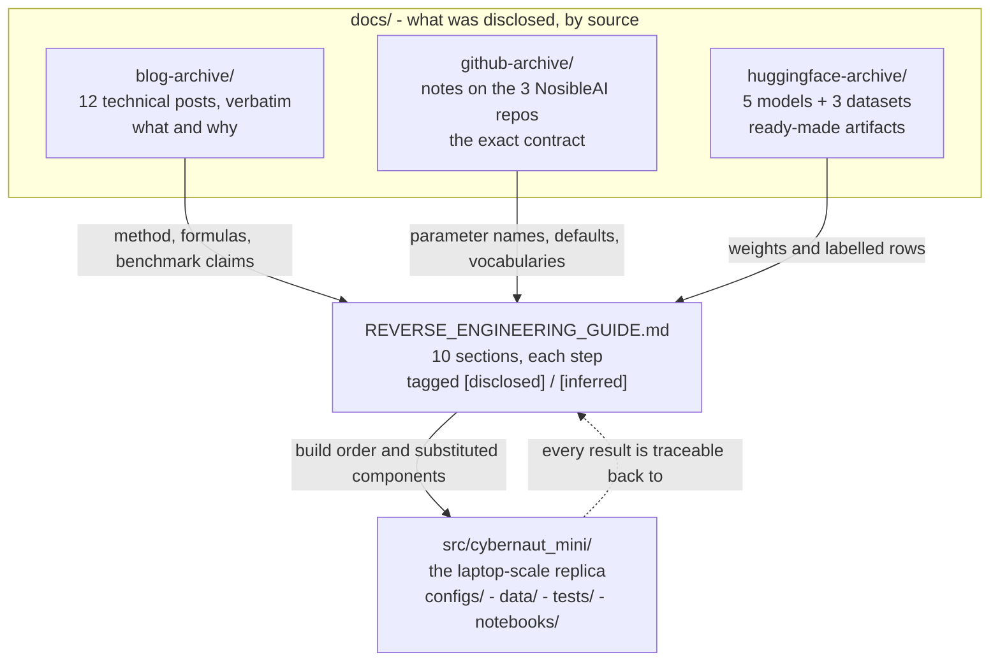

# `cybernaut_mini` documentation

Everything NOSIBLE has disclosed publicly, organised by source, plus the clean-room build
guide that turns it into a laptop-scale replica.

**Clean-room / educational only.** `cybernaut_mini` is unaffiliated with NOSIBLE and claims
no benchmark parity. Every artifact here was retrieved from a public endpoint — the public
blog, the `NosibleAI` GitHub org, and the `NOSIBLE` Hugging Face org. No private data,
credentials, or non-public interfaces were used.

## Contents

| Path | What it is |
|---|---|
| [`REVERSE_ENGINEERING_GUIDE.md`](REVERSE_ENGINEERING_GUIDE.md) | **Start here.** The clean-room build guide — 10 sections, each step tagged `[disclosed]` or `[inferred]`. |
| [`LEARNING_PATH.md`](LEARNING_PATH.md) | The same material as a route through the code: what to read, what to run, what to look for, in dependency order. |
| [`blog-archive/`](blog-archive/) | The 12 public technical posts, archived verbatim. |
| [`github-archive/`](github-archive/) | Notes on the 3 technical repos in the `NosibleAI` org. |
| [`huggingface-archive/`](huggingface-archive/) | Notes on the 5 models and 3 datasets in the `NOSIBLE` org. |

## What each source gives you

The three archives answer different questions, and the guide is where they combine.

| Source | Answers | Character |
|---|---|---|
| **Blog** | *What did they build, and why?* | Prose, formulas, benchmark claims. Rich on method, silent on parameters. |
| **GitHub** | *What is the exact contract?* | Parameter names, defaults, bounds, vocabularies. Turns prose into a spec. |
| **Hugging Face** | *Can I just have the artifact?* | Weights and 300k labelled rows. The one layer needing no reverse-engineering. |



## Where the replica's code lives

The archives and the guide describe NOSIBLE. This repository is the replica, and every
subsystem carries its own README naming the guide section it implements:

| Subsystem | Path | Guide |
|---|---|---|
| Core retrieval: sharding, routing, retrieval, RRF, evals | [`src/cybernaut_mini/`](../src/cybernaut_mini/README.md) | §1 |
| Agent search | [`agent/`](../src/cybernaut_mini/agent/README.md) | §2 |
| The 8-stage query pipeline | [`query/`](../src/cybernaut_mini/query/README.md) | §1 |
| Model providers: embeddings, judge, query rewrite | [`providers/`](../src/cybernaut_mini/providers/README.md) | §1, §2 |
| Kedro pipelines | [`pipelines/`](../src/cybernaut_mini/pipelines/README.md) | build + eval |
| WORLD: event layer, anchors, indices | [`world/`](../src/cybernaut_mini/world/README.md) | §4, §6, §8 |
| Sentiment lab: labelers, ensemble, distil | [`sentiment/`](../src/cybernaut_mini/sentiment/README.md) | §3 |
| Self-organising entity facets | [`entities/`](../src/cybernaut_mini/entities/README.md) | §7b |
| Measured notebooks | [`notebooks/`](../notebooks/README.md) | §1 |

[`LEARNING_PATH.md`](LEARNING_PATH.md) orders these into a sequence, with the exact
command to run at each step and the thing to observe once it finishes.
`cybernaut-mini explain --stage N` prints the same disclosed / assumed / rejected split
for any stage of the pipeline, sourced from `configs/learn/curriculum.yaml`.

Worked example — the blog says NOSIBLE probes shards of a ~250,000-shard index.
[`nosible-py`](github-archive/nosible-py.md) says `n_probes: int = 30`, bounded `[5, 50]`.
That single default reframes the whole retrieval problem: ~0.012% of the index is touched
per query, so recall must come from **query expansion**, not from scanning wider — and
[`nosible-mcp`](github-archive/nosible-mcp.md) then hands over the verbatim expansion
prompt that does it.

## The disclosure boundary

```
  crawl ──► smol-html ──────────► [ EVENT LAYER — the moat, never disclosed ]
            clean + minify                    │  dedup → 1 record/event
            [github]                          │  breadth (total_netlocs)
                                              │  GICS / IAB / geo tagging
                                              │  event dating
                                              ▼
                              nosible-py ──► Search API v2 · hybrid-3, 8 stages
                              [github]          │       [blog: method]
                                                │       [github: contract]
                                                └─► search(agent="cybernaut-1")
                                                        [blog: MCTS method only]
                                   │
                                   ├─► nosible-mcp ──► agent tools   [github]
                                   └─► enrichment ──► distilled 0.6B classifiers
                                                          [huggingface: weights + data]
```

Public code exposes the event layer only as **filter arguments** — you can select on
`country`, `sector`, or `iab_tier_2`, but nothing says how those labels are assigned.
Approximating that layer is the only genuinely original engineering a replica requires;
everything downstream is disclosed math. See
[`REVERSE_ENGINEERING_GUIDE.md`](REVERSE_ENGINEERING_GUIDE.md) §8.

## Attribution

- Blog posts and repository content: © Nosible Inc. GitHub repos are MIT
  (`nosible-mcp` states no licence); Hugging Face models are Apache-2.0.
- **Datasets are ODC-By v1.0 and require attribution** in any public use or derived
  database. Credit: Matthew Dicks, Simon van Dyk, Stuart Reid; NOSIBLE Inc.
