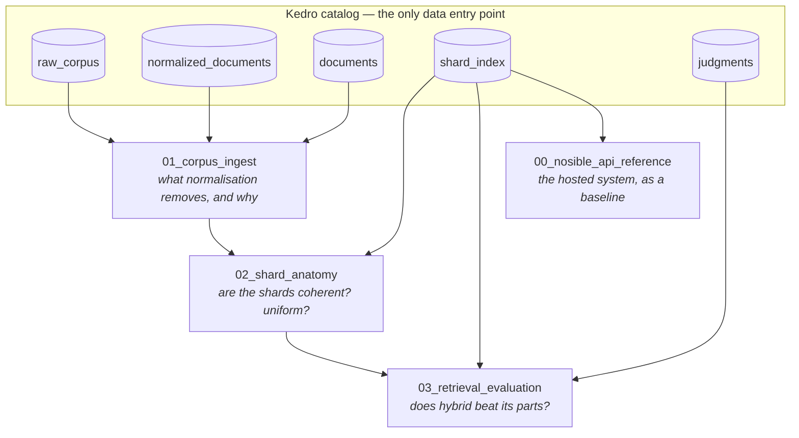

# `notebooks/` — the architecture, measured

Blog ref: [The Road to Cybernaut-1](https://nosible.com/blog/the-road-to-cybernaut-1).
Local copy: [`data/00_reference/the-road-to-cybernaut-1.md`](../data/00_reference/the-road-to-cybernaut-1.md).

The repo's job is to *teach* the architecture in that post. Prose can assert that shards
are coherent or that hybrid search wins; these notebooks compute whether it is true on a
corpus you can rebuild yourself — and report the answer even when it is unflattering.

Every notebook reads through the **Kedro catalog**. None of them opens a data path.
That is what lets the same notebook run against the committed fixture slice and a 100,000-row
Hugging Face corpus with one argument changed.



## The notebooks

| Notebook | Question it answers | Headline finding |
|---|---|---|
| [`00_nosible_api_reference.ipynb`](00_nosible_api_reference.ipynb) | What does the real hosted API look like, and where does our replica fall short? | Stage 4 instruction steering is a real parameter upstream and **not built** here |
| [`01_corpus_ingest.ipynb`](01_corpus_ingest.ipynb) | How do raw source rows become a build-ready corpus? | Ids are content-derived, so a re-fetch in any row order rebuilds the identical index |
| [`02_shard_anatomy.ipynb`](02_shard_anatomy.ipynb) | Are the shards actually coherent, and evenly sized? | **Coherent** (~26σ above random) but **not uniform** at `n_shards=8` |
| [`03_retrieval_evaluation.ipynb`](03_retrieval_evaluation.ipynb) | Does hybrid retrieval beat lexical and dense? | **No** — on this corpus hybrid scores below pure lexical, and the notebook explains why |

## Running them

```bash
make notebooks        # execute all of them headlessly (what CI does)
scripts/lab.sh        # kedro jupyter lab on :8888, catalog pre-injected
```

Any kernel works — plain JupyterLab, VS Code, or the headless executor — because each
notebook bootstraps its own session:

```python
from cybernaut_mini.notebook import kedro_catalog, ensure_fixture_index

ensure_fixture_index()                # builds artifacts/fixture if absent, never overwrites
catalog = kedro_catalog()             # the same catalog the pipelines use
index = catalog.load("shard_index")   # a query-ready LoadedIndex
```

`kedro jupyter lab` also injects `catalog`, `context`, `session` and `pipelines`
automatically. The helper exists so the notebooks do not *depend* on that, which is what
makes them executable in the test suite.

Point any notebook at a different index without editing it:

```python
catalog = kedro_catalog(index_path="artifacts/prediction")
```

## How they are kept honest

`tests/test_notebooks.py` runs on every `make check` and asserts that each notebook:

1. **executes end to end** in a fresh kernel — the real anti-drift mechanism;
2. **contains a mermaid diagram**, so it renders as a teaching artifact on GitHub;
3. **never opens a data path directly** — the catalog is the only way in;
4. **is committed without outputs**, so diffs stay readable;
5. **is listed in this table** — an unlisted notebook is an unmaintained one.

Live network calls are off by default and asserted off in tests. The devcontainer makes
`NOSIBLE_API_KEY` ambient, so notebook `00` additionally requires an explicit opt-in
before it will spend credit:

```bash
CYBERNAUT_LIVE_API=1 scripts/lab.sh
```

## A note on the findings

Two of the four headline findings above are negative, and they are stated plainly on
purpose. The fixture corpus is real MIRACL passages and CC-News articles with 25 graded queries
— a good instrument for demonstrating *mechanisms* and a poor one for *choosing a
retrieval strategy*. To draw real conclusions, build a real index:

```bash
make install-prod
kedro run --pipeline production --env prod
```

then re-run these notebooks against it. Nothing in them needs to change.
