# `scripts/` — helper commands, grouped by tool

Every script `cd`s to the repo root itself, so you can run it from anywhere. They
assume `uv` is on your PATH. Make them executable once: `chmod +x scripts/**/*.sh`.

```mermaid
flowchart TD
    S["scripts/"]
    S --> UV["uv/<br/>environment"]
    S --> KED["kedro/<br/>pipeline tooling"]
    S --> NUM["numerai/<br/>compete + integration"]
    S --> ML["mlflow/<br/>experiment tracking"]
    S --> DEV["dev/<br/>quality + container"]
    S --> CL["claude/<br/>local-model env"]
    S --> ENT["entire_setup.sh<br/>session capture CLI + hooks"]
    S --> DOC["devcontainer_doctor.sh<br/>verify the container"]

    UV --> UV1["setup.sh — bootstrap (uv sync + arch + pre-commit)"]
    UV --> UV2["lock.sh — refresh uv.lock + requirements.txt"]
    KED --> K1["lab.sh — kedro jupyter lab"]
    KED --> K2["viz.sh — kedro-viz graph"]
    NUM --> N1["compete.sh — full tournament run"]
    NUM --> N2["mcp.sh — Numerai MCP token"]
    NUM --> N3["get_example_scripts.sh — clone reference repo"]
    ML --> M1["ui.sh — MLflow tracking UI"]
    DEV --> D1["check.sh — ruff + pytest"]
    DEV --> D2["select-arch.sh — m1/x86 param profile"]
    DEV --> D3["readme-sync.sh — pre-commit README guard"]
    DEV --> D4["shell.sh — exec into the dev container"]
    CL --> C1["set/reset-claude-env.sh — local LM Studio model"]
```



| Folder | Scripts | Docs |
| --- | --- | --- |
| [`uv/`](uv/README.md) | `setup.sh`, `lock.sh` | environment + lockfile |
| [`kedro/`](kedro/README.md) | `lab.sh`, `viz.sh` | notebooks + pipeline viz |
| [`numerai/`](numerai/README.md) | `compete.sh`, `mcp.sh`, `get_example_scripts.sh` | the tournament loop |
| [`mlflow/`](mlflow/README.md) | `ui.sh` | experiment tracking UI |
| [`dev/`](dev/README.md) | `check.sh`, `select-arch.sh`, `readme-sync.sh`, `shell.sh` | quality gate + arch + container shell |
| [`claude/`](claude/README.md) | `set-claude-env.sh`, `reset-claude-env.sh` | point Claude Code at a local model |
| _(root)_ | `entire_setup.sh` | install the Entire CLI and wire its git + Claude Code hooks |
| _(root)_ | `devcontainer_doctor.sh` | verify node/claude/omc/uv/.venv/kedro/notebooks/catalog/entire |

## The typical loop

```bash
./scripts/uv/setup.sh                 # first time: build .venv
./scripts/numerai/compete.sh          # data → tune → train → predict → submit
./scripts/kedro/viz.sh                # explore the pipeline visually
./scripts/mlflow/ui.sh                # compare runs over time
./scripts/dev/check.sh                # ruff + pytest before committing
uv add <pkg> && ./scripts/uv/lock.sh  # after changing dependencies
```

For the `uv` workflow and MCP background, see [docs/uv.md](../docs/uv.md) and the
per-folder READMEs.
