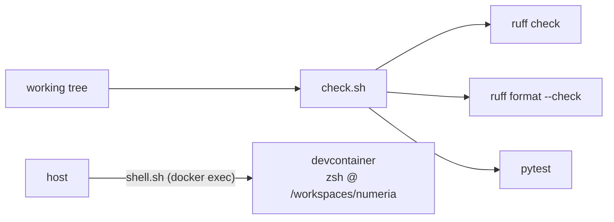

# `scripts/dev/` — quality gate & container access

| Script | Does |
| --- | --- |
| `check.sh` | the pre-commit gate: `ruff check` + `ruff format --check` + `pytest`. Run before committing. |
| `select-arch.sh` | point `conf/base/parameters.yml` at the M1 or x86 LightGBM thread profile: `m1` / `x86` / `auto` (detect from `uname -m`) / `status`. Run by `scripts/uv/setup.sh` on bootstrap. |
| `readme-sync.sh` | pre-commit guard: blocks a commit that changes a pipeline's `nodes.py`/`pipeline.py` without touching that pipeline's `README.md` (keeps the mermaid diagrams honest). Override with `README_SYNC_SKIP=1`. |
| `shell.sh` | open a shell **inside** the running devcontainer from the host. Auto-detects the container (no hardcoded name); override with `CONTAINER=`/`USER_IN=`/`WORKDIR=`. Exports `$SHELL` (docker exec leaves it unset) and injects the current repo `.env` at exec time, so secrets written after container create (e.g. `CLAUDE_CODE_OAUTH_TOKEN`) work without a rebuild. |

## Arch-specific parameters

`conf/base/parameters.yml` is a **symlink** (committed) to one of two source
files that differ only in `model.lgbm_fixed` thread settings:

- `parameters_m1.yml` — Apple-Silicon: `n_jobs/num_threads: 8`, `force_col_wise`.
- `parameters_x86.yml` — Intel/AMD/Rosetta: `n_jobs/num_threads: 4`.

`settings.py` restricts the parameter glob to just `parameters.yml`, so the two
source files don't double-load. Edit **both** source files for any non-thread
change. Switch with `./scripts/dev/select-arch.sh {m1,x86,auto}`.

`check.sh` mirrors the pre-commit hooks (`.pre-commit-config.yaml`); tests are
all offline (see [tests/README.md](../../tests/README.md)).
