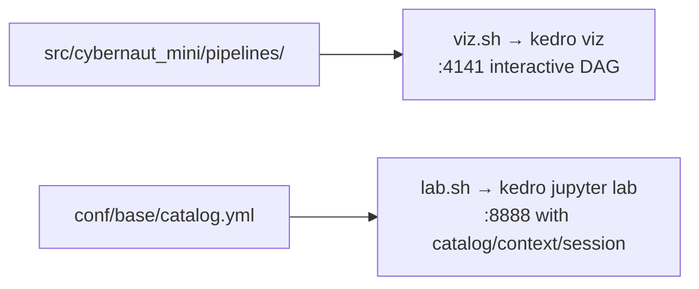

# `scripts/kedro/` — pipeline tooling

Convenience wrappers around Kedro's own commands, bound to `0.0.0.0` so they're
reachable from the devcontainer host.

| Script | Does | Port (override) |
| --- | --- | --- |
| `viz.sh` | `kedro viz` — interactive pipeline graph in the browser | `4141` (`PORT=`) |
| `lab.sh` | `kedro jupyter lab` — JupyterLab with `catalog`, `context`, `session`, `pipelines` pre-injected | `8888` (`PORT=`) |

See [notebooks/README.md](../../notebooks/README.md) for working inside `lab.sh`,
and [src/cybernaut_mini/pipelines/corpus_ingest/README.md](../../src/cybernaut_mini/pipelines/corpus_ingest/README.md) for what the graph shows.
