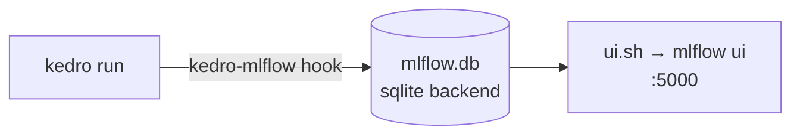

# `scripts/mlflow/` — experiment tracking

| Script | Does | Port (override) |
| --- | --- | --- |
| `ui.sh` | MLflow tracking UI against the **same** backend as `conf/base/mlflow.yml` (`sqlite:///mlflow.db`). Override with `MLFLOW_BACKEND=` / `PORT=`. | `5000` |

The backend URI **must** match `conf/base/mlflow.yml`, or the UI shows no runs.
Params/metrics are logged automatically by the `modeling` pipeline (see
[modeling/README.md](../../src/numeria/pipelines/modeling/README.md)).
