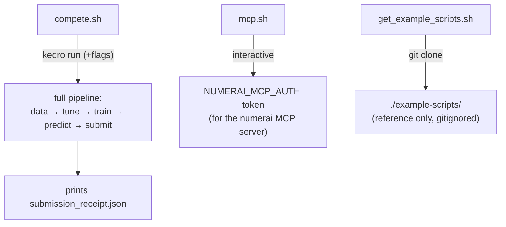

# `scripts/numerai/` — compete & integrate

The Numerai-facing scripts: the headline competition run, the MCP token setup,
and the reference example-scripts fetcher.

| Script | Does |
| --- | --- |
| `compete.sh` | the main event — `kedro run` end-to-end. `--dry-run` skips the upload; `--submit-only` reuses the trained model (fetch live → predict → submit). Prints the receipt. |
| `mcp.sh` | interactive setup of the Numerai **MCP** auth token (opens a browser). The `numerai` MCP server is declared in `.mcp.json`; this only obtains its key. |
| `get_example_scripts.sh` | clone/refresh Numerai's official `example-scripts` repo into `./example-scripts` for **reference** — it's ~83M with its own git history and is **gitignored**, never committed here. |

The competition flow, scoring, and automation (cron / Claude routines) are
documented in the [root README](../../README.md). API keys for the **upload**
(`NUMERAI_PUBLIC_ID` / `NUMERAI_SECRET_KEY`) go in `.env`; the **MCP** key
(`NUMERAI_MCP_AUTH`) goes in your host environment.
