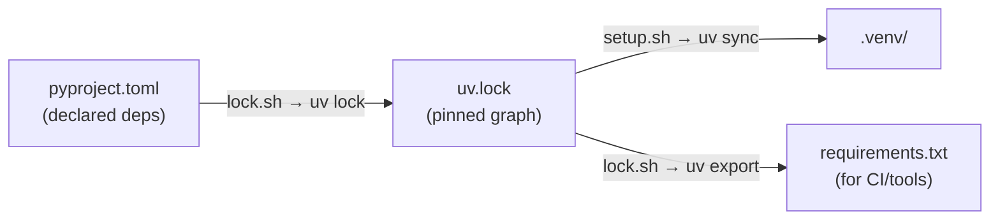

# `scripts/uv/` — environment management

Wrappers around [uv](../../docs/uv.md), which manages the project's `.venv`,
dependencies, and lockfile from `pyproject.toml`.

| Script | Does |
| --- | --- |
| `setup.sh` | bootstrap from a clean checkout: `uv sync` (builds `.venv` from the lock), installs pre-commit hooks, prints `kedro info`. Run first, safe to re-run. |
| `lock.sh` | re-resolve deps → rewrite `uv.lock`, sync `.venv`, and export a plain `requirements.txt`. Run after editing dependencies in `pyproject.toml`. |

Both `unset VIRTUAL_ENV` first so a stale activated venv can't redirect uv away
from the project's `./.venv`.
