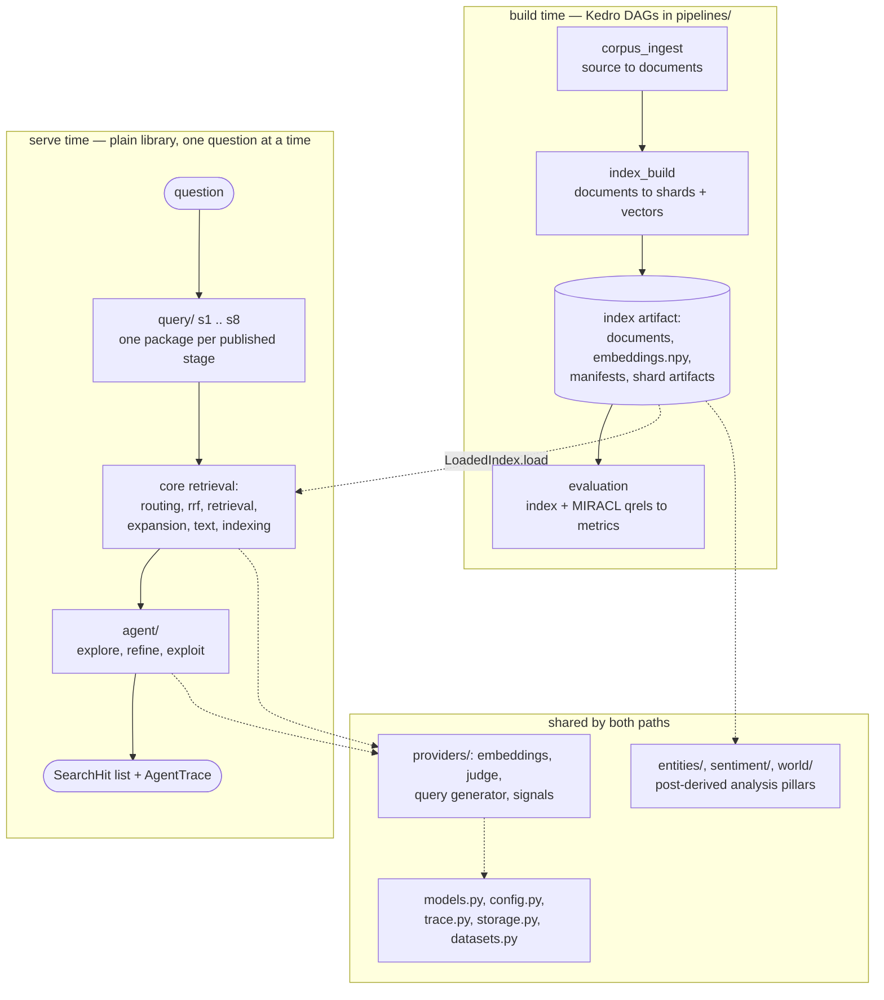

# `cybernaut_mini` — the package hub

Blog ref: https://nosible.com/blog/the-road-to-cybernaut-1 — the eight-stage
Hybrid-3 retrieval pipeline. Blog ref:
https://nosible.com/blog/introducing-cybernaut-1-agentic-search-with-mcts — the
LLM-guided search layer built above it.

Local copies: [reference copy](../../data/00_reference/the-road-to-cybernaut-1.md)
and [blog archive](../../docs/blog-archive/introducing-cybernaut-1-agentic-search-with-mcts.md).
The build guide that maps each post claim onto a module is
[`docs/REVERSE_ENGINEERING_GUIDE.md`](../../docs/REVERSE_ENGINEERING_GUIDE.md):
section 1 for stages 1–8, section 2 for the agent.

This package is the whole implementation. A corpus is turned into a sharded index
by the build half; one question at a time is answered by the serve half.
Everything else is either a provider both halves share, or one of the three
analysis pillars built on the same corpus.

## The six subsystems

- **Core retrieval** — the top-level `*.py` in this package. K-means sharding,
  feature computation, index persistence, stage-5 selection, stage-6 shard
  reranking, stage-8 map-reduce retrieval, RRF and query expansion. Entry points:
  [`routing.py`](routing.py), [`retrieval.py`](retrieval.py),
  [`indexing.py`](indexing.py), [`sharding.py`](sharding.py),
  [`expansion.py`](expansion.py).
- **Query stages** — [`query/`](query/), one subpackage per published stage,
  `s1_language` … `s8_retrieve`, numbered so the post and the source line up.
  `query/live.py` is what puts stages 1, 2 and 4 on the serving path. See
  [`query/README.md`](query/README.md).
- **Search agent** — [`agent/`](agent/): the Explore → Refine → Exploit beam
  search, its UCT budget allocation, the node/state/action/policy split and the
  reward. See [`agent/README.md`](agent/README.md).
- **Providers** — [`providers/`](providers/): embedders, the result judge, the
  query generator and the per-hit signal renderer. Each sits behind a protocol
  with a free heuristic default and an opt-in model-backed implementation. See
  [`providers/README.md`](providers/README.md).
- **Pipelines** — [`pipelines/`](pipelines/): the Kedro DAGs `corpus_ingest`,
  `judgment_ingest`, `index_build` and `evaluation`, and the reason search is
  *not* one of them. See [`pipelines/README.md`](pipelines/README.md).
- **Analysis pillars** — [`entities/`](entities/), [`sentiment/`](sentiment/) and
  [`world/`](world/): the later posts' work, each with its own README.
  Self-organising entity facets, the labeler-benchmark-distillation arc, and the
  event-store WORLD pillar.

## The boundary the diagram draws

The two halves are split by *shape*, not by topic. `pipelines/` holds a static,
pre-declared DAG whose every input is a catalog dataset, so it is replayable and
`kedro viz` can draw it. The serve half branches at request time — UCT picks the
next node to expand from results already seen, and one budget counter is shared
across all three stages — so it is a library behind the Typer CLI (`cli.py`)
rather than a DAG. The rejected alternative (wrapping a search request in a
one-node pipeline) is argued in [`pipeline_registry.py`](pipeline_registry.py).

`providers/` is the one seam both halves cross: the build embeds with an
`EmbeddingProvider`, and the agent embeds, judges and rewrites through the same
protocols, so a heuristic run and a model-backed run differ only in config.

## Key entry points

- `cli.py` — the Typer app: `build`, `search`, `eval`, `inspect-shards`.
- `pipeline_registry.py` — the Kedro `register_pipelines()` map, including the
  `production` composition.
- `retrieval.retrieve` and `routing.route` — one lexical, dense or hybrid query
  against a `LoadedIndex`.
- `agent.search.run_agent_search` — one full agent question; returns the hits,
  the executed plan and the trace.
- `indexing.LoadedIndex` / `indexing.write_index` — open an index for querying,
  and write one the canonical way.
- `query.live.prepare` — the stage-1/2/4 front door the serve path runs before
  tokenizing, embedding or routing.

## Where the numbers come from

Every number in the child READMEs is measured in this repository, not copied from
the post: the fixture evaluation table, the reward weights, the 5+9+4 schedule and
the manifest-size measurements live in the root [`README.md`](../../README.md) and
in the module docstrings that own them. Where a value is *inferred* rather than
disclosed, the module says so with `[inferred]` and states what was rejected.
That convention is executable — see
[`tools/docs_check.py`](../../tools/docs_check.py).

## What to read next

1. [`docs/REVERSE_ENGINEERING_GUIDE.md`](../../docs/REVERSE_ENGINEERING_GUIDE.md)
   section 1 for stages 1–8, section 2 for the agent.
2. [`pipelines/README.md`](pipelines/README.md) to see how a corpus becomes an
   index, then [`query/README.md`](query/README.md) to follow one question through
   the eight stages.
3. [`agent/README.md`](agent/README.md) and [`providers/README.md`](providers/README.md)
   for the search loop and the heuristic-vs-model split.
