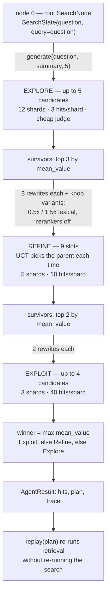

# `agent` — Explore, Refine, Exploit over the shard index

Blog ref: https://nosible.com/blog/introducing-cybernaut-1-agentic-search-with-mcts —
the post's LLM-guided MCTS layer on top of Hybrid-3: search "starts wide and
shallow, then narrows and deepens" while balancing exploration, exploitation and
inference cost, and the agent may tune every knob of the pipeline it searches.
Its environment is the eight stages of
https://nosible.com/blog/the-road-to-cybernaut-1.

Local copies:
[blog archive](../../../docs/blog-archive/introducing-cybernaut-1-agentic-search-with-mcts.md)
and [reference copy](../../../data/00_reference/the-road-to-cybernaut-1.md).

## What one run does

One retrieval call is one candidate query executed across its selected shard set.
`max_retrieval_calls` (default **18**) is shared by all three stages, and the
default schedule spends **5 + 9 + 4** of it; the seed routing call before Explore
is not charged as a candidate.

## The node / state / action / policy split

- [`state.py`](state.py) — `SearchState`, frozen, carrying the query, shard ids,
  expansions, weights, filter, routing signals and hits; plus `StateSummary`, the
  only view a query generator is given.
- [`actions.py`](actions.py) — the typed action union: `RewriteQuery`,
  `AddExpansions`, `NarrowShards`, `AdjustHybridWeights`, `RetainFilter`,
  `ToggleRerankers`. `RetainFilter` only ever carries the user's own filter.
- [`node.py`](node.py) — `SearchNode`, `uct_score`, `backpropagate`, and
  `select_child`'s unvisited-first, deterministic ordering.
- [`policy.py`](policy.py) — `compute_reward` and the weights
  `0.45 relevance + 0.20 coverage + 0.20 dense + 0.10 lexical + 0.05 diversity`.
- [`schedule.py`](schedule.py) — `StagePolicy`, the `DEFAULT_SCHEDULE` and
  `ANNEALED_SCHEDULE` values, and `schedule_from_config`.
- [`search.py`](search.py) — `SearchAgent`: the loop, the budget counter, survivor
  selection, the winner and the trace.

A state is never mutated after its reward is computed: transitions go through
`SearchState.evolve`, and `select_child` breaks ties by
`(action type name, canonical payload)`, so one question plus seed replays to the
same tree.

## UCT budget allocation

`select_child` expands unvisited children first, then takes the maximum
`mean_value + c * sqrt(ln(N_parent + 1) / (N_i + 1))` with `c = 1.2`. In Refine
that choice decides **which survivor gets the next candidate slot**, so a
survivor whose subtree keeps paying off is expanded more often — the allocation
half of the post's exploration/exploitation balance. Explore branches from the
root only and Exploit follows the Refine survivors, so the wide-to-narrow shape is
structural rather than emergent.

`ANNEALED_SCHEDULE` states that shape as numbers: branching `k_children`
4 → 2 → 1, per-node retrieval depth `top_k` 10 → 20 → 40, generator temperature
1.0 → 0.6 → 0.3, still inside 18 calls. Select it with
`agent.stage_schedule: annealed`, or override single fields with a per-stage map.

## Honest scope

This is a **staged beam search with UCT ordering inside Refine**, not full MCTS.
The post discloses no reward function, no UCT constant, no action space and no
depth, so every number above is inferred and documented as such in
[`schedule.py`](schedule.py) and [`policy.py`](policy.py). The build guide lists
those four omissions as this section's open gaps; the design here is the smallest
one that spends a bounded, counted budget and produces a replayable trace.

## Read next

- [`providers/README.md`](../providers/README.md) — which generator and judge run
  by default (both heuristic, zero model calls) and how to opt into models.
- [`../trace.py`](../trace.py) — `AgentTrace`, `NodeTrace`, the stop reasons and
  the per-stage `phase_accounting` block.
- [`../query/README.md`](../query/README.md) — the stages each action re-tunes.
- Root [`README.md`](../../../README.md) for an annotated trace and the fixture
  evaluation table, including when agent mode does *not* beat plain hybrid.
