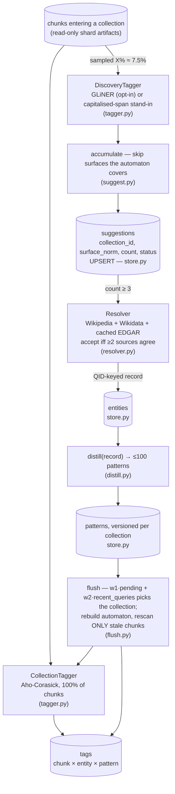

# `entities` — the self-organising faceted-entity loop

Blog ref: [can-faceted-search-at-web-scale-self-organize](https://nosible.com/blog/can-faceted-search-at-web-scale-self-organize) —
this package is that post's "Distilling Agents" design, one module per moving part.
Local copy: [`docs/blog-archive/can-faceted-search-at-web-scale-self-organize.md`](../../../docs/blog-archive/can-faceted-search-at-web-scale-self-organize.md).

## The loop

Every collection runs two taggers. The fast one is a per-collection Aho-Corasick
automaton over distilled patterns — not neural, rebuilt at flush, sees 100% of
chunks. The slow one is a universal NER model that sees a sampled X% (default 7.5%,
the middle of the 5–10% band) and only ever *suggests*. Suggestions the automaton
does not already cover accumulate in SQLite; at three sightings a surface is
promoted to the Resolver, which identifies the entity with free tools (Wikipedia,
Wikidata, cached SEC EDGAR) and is believed only when **two independent sources
agree** on the identity. Accepted records are distilled into ≤100 lowercase
patterns, and the next flush rebuilds the automaton and rescans **only the chunks
whose `last_tagged_version` is stale** — the post's "this happens in seconds".

## Modules

| Module | Post claim it answers for |
|---|---|
| `store.py` | "suggestions are accumulated in a small database", versioned patterns, `last_tagged_version` |
| `tagger.py` | the two taggers: exact Aho-Corasick production + sampled neural discovery |
| `suggest.py` | threshold-gated promotion (count ≥ 3) of surfaces the automaton doesn't cover |
| `resolver.py` | the Resolver Agent, its tools, the post's record schema field-for-field, QID cache |
| `distill.py` | record → unigram/bigram/trigram patterns, tested against the JPMorgan list |
| `flush.py` | flush-time pattern propagation, stale-only rescans, importance-weighted scheduling |
| `metrics.py` | entity×collection sparsity; scoped-vs-global precision of an ambiguous unigram |
| `facets.py` | "map the query to the most relevant facets and search within them" — query-time facet detection (the same AC automata over the query + cosine vs per-facet centroids) emitting a `DocAllowlistFilter` that rides retrieval's existing `MetadataFilter` seam; no facet hit ⇒ `None` ⇒ global fallback |
| `disambig.py` | two-stage company-name disambiguation: AC anchor keywords (execs/board from the cached Wikidata records) → high-conviction seed set → NB + LR + domain-prior ensembled by probability averaging over (source domain, country mentions, body TF-IDF) |
| `ingest_stream.py` | simulated streaming "days": route new docs to the nearest **frozen** centroid, per-shard append (only touched shards recompute), re-run `evals.evaluate` per increment for the nDCG-vs-corpus-size curve; each day also exercises the loop's X% sampling and importance-weighted flushes. Driver: `scripts/simulate_ingest.py` |

## Data

- `configs/entities/jpmorgan.json` and `configs/entities/jpmorgan_patterns.json` —
  the post's JPMorgan record and distilled pattern list, verbatim.
- `data/01_raw/entities/` — real cached Wikipedia/Wikidata lookups for the worked
  example, produced by the tools' own normalisation code; a warm cache makes every
  tool fully offline.
- `data/01_raw/edgar/company_tickers.json` — a real excerpt (top 300 rows) of the
  SEC's public ticker↔CIK file.

Network is doubly opt-in: every tool caches to canonical JSON and a cache miss
raises unless `CYBERNAUT_MINI_ENTITIES_NETWORK=1` is exported. The LLM agent uses
the repo's OpenAI-compatible client discipline (`OPENROUTER_API_KEY` /
`OPENAI_API_KEY` read at call time) and its output passes through the same
two-source acceptance rule as the deterministic resolver — the model proposes,
the tools certify.
