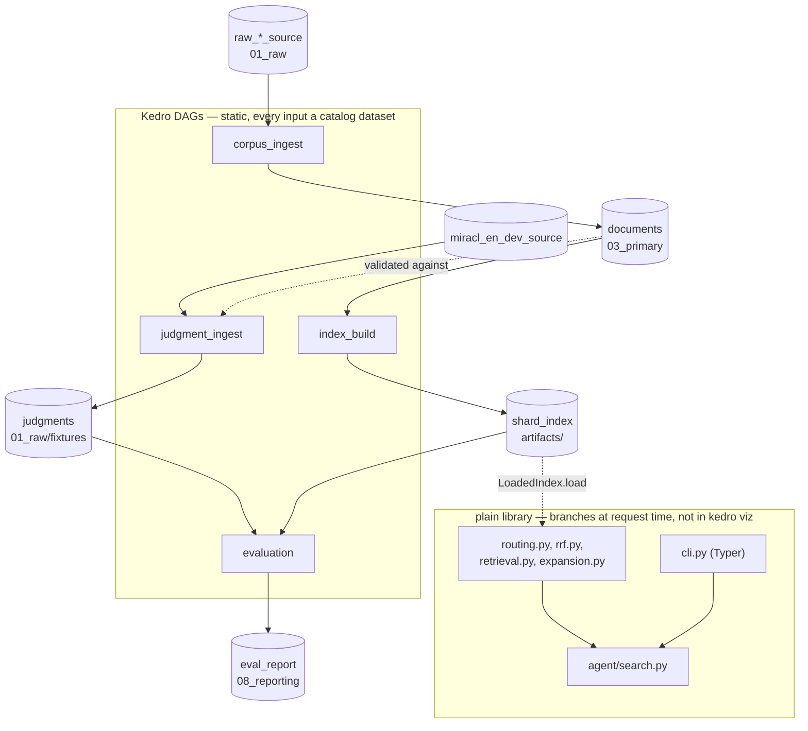

# `pipelines` — the Kedro DAGs, and the boundary where Kedro stops

Blog ref: https://nosible.com/blog/the-road-to-cybernaut-1 — the build-time half
of the architecture diagram is a DAG (source → documents → shards → index), while
the query-time half is the eight-stage request path. This package registers the
DAGs; the request path deliberately lives outside it. Local copy:
[reference copy](../../../data/00_reference/the-road-to-cybernaut-1.md).

## The registry

[`pipeline_registry.py`](../pipeline_registry.py) is the single place that says
which DAGs exist:

- `corpus_ingest` — snapshot → normalize → merge → select; produces `documents`.
- `judgment_ingest` — `build_miracl_judgments` → `validate_judgments`; produces
  `judgments`.
- `index_build` — six nodes: ingest → text/embed → shard → manifests → payload;
  produces `shard_index`.
- `evaluation` — `validate_judgments` → `evaluate_node` → `report_node`; produces
  `eval_report`.
- `production` — `corpus_ingest + judgment_ingest + index_build`: a pinned source
  all the way to a queryable index.
- `__default__` — `index_build`, so a bare `kedro run` builds an index.

`production` is a composition, not a new pipeline: acquisition stays separately
runnable, and re-running the build over an already-snapshotted corpus costs zero
network calls. `sentiment_label` and `sentiment_distil` are not registered yet;
they run through their node functions directly until their catalog entries and
parameter blocks land, as their READMEs state.

## Where the DAG boundary is, and why

- `corpus_ingest` (Kedro) — slow, networked and rate-limited. Run once, and the
  `01_raw` snapshot makes every later build offline and auditable.
- `index_build` (Kedro) — a pure map-reduce DAG over a fixed corpus. Replayable,
  cacheable per node, and drawable by `kedro viz`.
- `evaluation` (Kedro) — reproducible only against a pinned qrels file plus an
  existing index, which is exactly the shape a catalog models.
- Routing and retrieval (library) — per-request: the input is a question string,
  not a dataset.
- Agent search (library) — UCT picks the next node from results already seen, and
  one budget counter is shared across three stages.

Kedro's catalog model assumes the DAG is known before the run starts. The agent's
tree is not: which node expands next depends on rewards computed during the run,
and the 18-call budget is one mutable counter crossing stage boundaries. Encoding
that as nodes would mean re-deriving the tree from intermediate datasets after the
fact — a diagram of a search rather than a search. So `cli.py` exposes
`search --mode agent` as a Typer command, and `kedro viz` shows only the build and
evaluation DAGs.

The one thing the two halves share is the artifact contract:
`ShardIndexDataset` writes one directory (`_VALID` last) and `LoadedIndex.load`
reads it, so the library can consume an index without knowing a pipeline built it
and `kedro run` can hand its output straight to the CLI.

## Read next

- [`corpus_ingest/README.md`](corpus_ingest/README.md) — source to build-ready
  corpus, with the field-map-as-data rule.
- [`index_build/README.md`](index_build/README.md) — the six-node build DAG.
- [`evaluation/README.md`](evaluation/README.md) — the four-mode benchmark and the
  shard-recall caveat.
- `sentiment_label/README.md` and `sentiment_distil/README.md` — the
  not-yet-registered pipelines.
