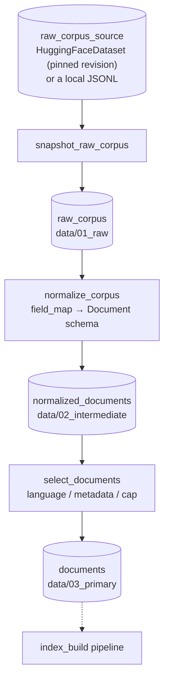

# `corpus_ingest` — from an external source to a build-ready corpus

Blog ref: [the-road-to-cybernaut-1](https://nosible.com/blog/the-road-to-cybernaut-1) —
this pipeline produces the **Documents** node at the head of the build-time half of
the architecture diagram, upstream of text processing, embedding, and shard learning.
Local copy: [`data/00_reference/the-road-to-cybernaut-1.md`](../../../../data/00_reference/the-road-to-cybernaut-1.md).

## Why it is a separate pipeline

Fetching a corpus is slow, networked, and rate-limited; it should run once. Building
an index over that corpus is fast and gets repeated many times while shard count,
keyword limits, and embedding choices are tuned. Splitting the two means a config
sweep costs zero network calls. `kedro run --pipeline production` composes them back
together when a single end-to-end run is what you want.

## Flow



## The three layers

| Layer | Dataset | What it holds |
|---|---|---|
| `01_raw` | `raw_corpus` | Source rows verbatim. Once written, the build no longer needs the Hub, and the exact bytes a shard was built from stay on disk for audit. |
| `02_intermediate` | `normalized_documents` | Mapped onto the `Document` schema: derived titles, stable hashed ids, collapsed whitespace, junk rows dropped. |
| `03_primary` | `documents` | Filtered and capped — the corpus a build actually consumes. |

Selection happens *after* normalisation so narrowing the corpus never requires
re-downloading it.

## Retargeting to a different source

The field mapping is data, not code. A new source needs a catalog entry and a
`corpus.field_map`, never a new normaliser:

```yaml
# conf/prod/catalog.yml
raw_corpus_source:
  type: cybernaut_mini.datasets.HuggingFaceDataset
  repo_id: NOSIBLE/prediction
  revision: <commit-sha>        # a moving ref is rejected at load time
  columns: [text, label, netloc, url]
```

```yaml
# conf/prod/parameters.yml
corpus:
  field_map: {text: text, url: url}
  metadata_fields: [label, netloc]
  min_text_chars: 120
```

## Determinism

Document ids are `blake2b` hashes of the source's natural key (its `url`, or the body
text when there is none), so ids do not depend on row order. Re-running over the same
pinned revision yields the same ids, the same shard assignments, and the same
byte-for-byte index.

## Failure behaviour

Each node raises rather than passing an empty list downstream, so a wrong `field_map`
or an over-tight filter surfaces here instead of as a confusing failure several nodes
later. Individual unusable rows are skipped, not raised on — one malformed row out of
100,000 must not fail a multi-hour build.
