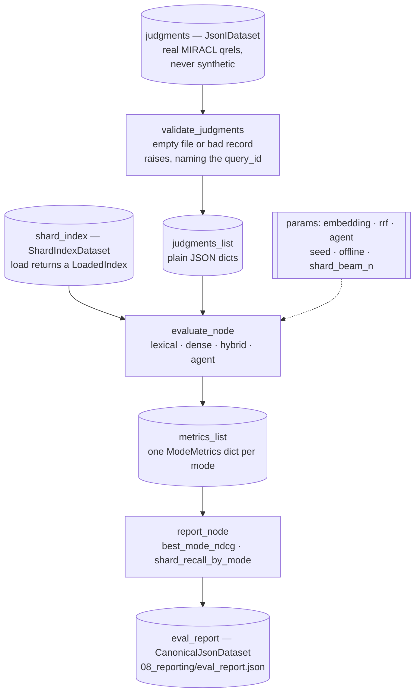

# `evaluation` — score every retrieval mode against real qrels

Blog ref: https://nosible.com/blog/the-road-to-cybernaut-1 — the post mentions a
per-shard "Evals"; this pipeline is that idea taken to whole-corpus modes: nDCG,
recall and MRR against human relevance judgments, plus the shard-level recall that
says whether routing found the right shards at all. Local copy:
[reference copy](../../../../data/00_reference/the-road-to-cybernaut-1.md).



## What a run produces

`ModeMetrics.as_dict()` per mode: `recall_at_5`, `recall_at_10`, `mrr_at_10`,
`ndcg_at_10`, `shard_recall_at_n`, `mean_retrieval_calls`, `mean_llm_calls` and an
informational `wall_clock_seconds`. `report_node` adds the best mode by nDCG@10
and a per-mode map of shard recall.

- **lexical / dense / hybrid** are one `retrieve()` call per query.
- **agent** is a full three-stage search; its call counts come from
  `AgentResult.trace.retrieval_calls` and `trace.llm_calls`, so the report shows
  what the extra quality actually cost.
- `shard_recall_at_n` is **not** comparable across those two groups and is never
  averaged. For the static modes it measures *router quality* from one shared
  `route()` call; for agent mode it measures the shards the search *explored*.
  The per-mode map exists precisely so nobody divides one by the other.

## Why it is its own pipeline

A build is reproducible from a corpus plus a seed. An evaluation is reproducible
from an index plus a pinned qrels file, and you want to re-run it — changing
`params:agent`, say — without rebuilding anything. Splitting the two also means a
malformed qrels file fails in `validate_judgments` before a single retrieval runs.

Real human judgments are a hard rule here, not a preference: the repo bans
synthetic corpora and fabricated qrels because they silently poison every
downstream number. See [`data/README.md`](../../../../data/README.md) and the
`no-dummy-data` check in [`tools/docs_check.py`](../../../../tools/docs_check.py).

## Running it

```bash
kedro run --pipeline evaluation --params \
  "index_path=artifacts/fixture,judgments_path=data/01_raw/fixtures/judgments.jsonl,offline=true"
```

The CLI equivalent is `cybernaut-mini eval`, which calls `evals.evaluate`
directly; both paths produce the same metric dicts. The fixture numbers, and an
explicit note on when agent mode does *not* beat plain hybrid, are in the root
[`README.md`](../../../../README.md).

## Read next

- [`nodes.py`](nodes.py) — the three node functions and their assumptions.
- [`pipeline.py`](pipeline.py) — the node wiring and the parameters it binds.
- [`../../evals.py`](../../evals.py) — the metric implementations and the runner.
- [`../README.md`](../README.md) — the other registered pipelines.
