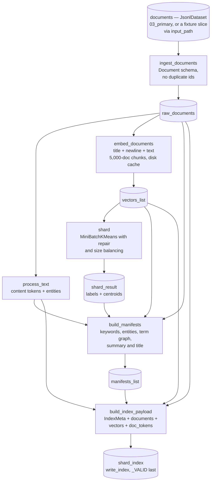

# `index_build` — six nodes from a corpus to a queryable index

Blog ref: https://nosible.com/blog/the-road-to-cybernaut-1 — the build half of the
architecture diagram: documents in, a sharded and embedded index out, carrying the
artifacts the request path reads later. Centroids and shard summaries for stage 5
(shard selection), keywords and entities for the sparse selectors, and a per-shard
co-occurrence graph for stage 7 (shard-based expansion). Local copy:
[reference copy](../../../../data/00_reference/the-road-to-cybernaut-1.md).



## The six nodes

- `ingest_documents` (`documents` → `raw_documents`) — validates the Document
  schema and the no-duplicate-ids rule, so a malformed corpus fails before
  embedding rather than half-way through it.
- `process_text` (`raw_documents` → `text_result`) — `TextProcessor(use_spacy=None)`:
  content tokens plus entity strings per document.
- `embed_documents` (`raw_documents`, `params:embedding`, `params:offline` →
  `vectors_list`) — embeds `title\ntext` per document, logs the resolved device,
  and warns when a sentence-transformers build silently falls back to CPU on
  Apple silicon.
- `shard` (`vectors_list`, `params:index`, `params:seed` → `shard_result`) —
  `sharding.shard_documents`: MiniBatchKMeans, empty-cluster repair, size
  balancing.
- `build_manifests` (`raw_documents`, `vectors_list`, `shard_result`,
  `text_result`, `params:embedding`, `params:index` → `manifests_list`) — per-shard
  `ShardManifest`: centroid, keywords, entities, term graph, summary, title.
- `build_index_payload` (`raw_documents`, `vectors_list`, `manifests_list`,
  `text_result`, `params:embedding`, `params:seed` → `shard_index`) — `IndexMeta`
  plus the documents, vectors and tokens, as one plain dict.

`process_text` and `embed_documents` branch off `raw_documents` independently, and
`shard` depends only on `vectors_list`, so Kedro may run those branches
concurrently. No node opens a corpus or index path: the corpus arrives from the
catalog and the finished index leaves as a payload that `ShardIndexDataset.save`
writes. That canonical write is also where the per-shard artifacts the blog lists
— phrase bloom filter, trained Zstandard dictionary, vocabulary — are built
(`write_index`, read back one shard at a time via `LoadedIndex.shard_artifacts`).
The one file-system side effect inside a node is the embedding chunk cache under
`data/06_models/embed_cache`.

## Why the term graph is built here, per shard

Stage 7 needs the graph to belong to the shard, not the corpus: "'gene' in shard
11,343 only has the genetic meaning." An earlier version computed one graph over
the whole corpus and copied it into every manifest. Measured on a 2,000-document /
32-shard build: **4,072 KB per manifest and 301 MB retained heap at load**, against
**80 KB and 8 MB** with a per-shard, capped graph. The measurement and the rejected
alternative are recorded in [`nodes.py`](nodes.py).

## Determinism and resumability

- Document ids are content-derived and every JSON artifact goes through
  `canonical_dumps` (sorted keys, rounded floats), so a re-run with the same seed
  and provider is byte-identical — within one device and one sklearn version.
- The embedding cache is keyed on `(model identifier, revision)` and writes one
  `.npy` per 5,000-document chunk with a `manifest.json`. A crash at chunk *k*
  resumes from chunk *k+1* instead of re-encoding the corpus.
- MPS and CPU do not produce bit-identical vectors. `IndexMeta` records the
  embedding model, revision and dimension, and `accel.device_fingerprint()` renders
  what produced a build; compare two indexes byte-for-byte only when their
  fingerprints agree.

## Running it

```bash
kedro run --pipeline index_build --params \
  "input_path=data/01_raw/fixtures/documents.jsonl,\
index_path=artifacts/fixture,seed=42,offline=true"
```

`index_build` is also `__default__`, so a bare `kedro run` builds an index.
`production` composes it with `corpus_ingest` and `judgment_ingest` for an
end-to-end run — see [`../README.md`](../README.md).

## Read next

- [`nodes.py`](nodes.py) — the node implementations, the term-graph measurement
  and the chunk-cache format.
- [`pipeline.py`](pipeline.py) — the node wiring and its parameter bindings.
- [`../corpus_ingest/README.md`](../corpus_ingest/README.md) — where `documents`
  comes from.
- [`../evaluation/README.md`](../evaluation/README.md) — scoring the index this
  pipeline produces.
