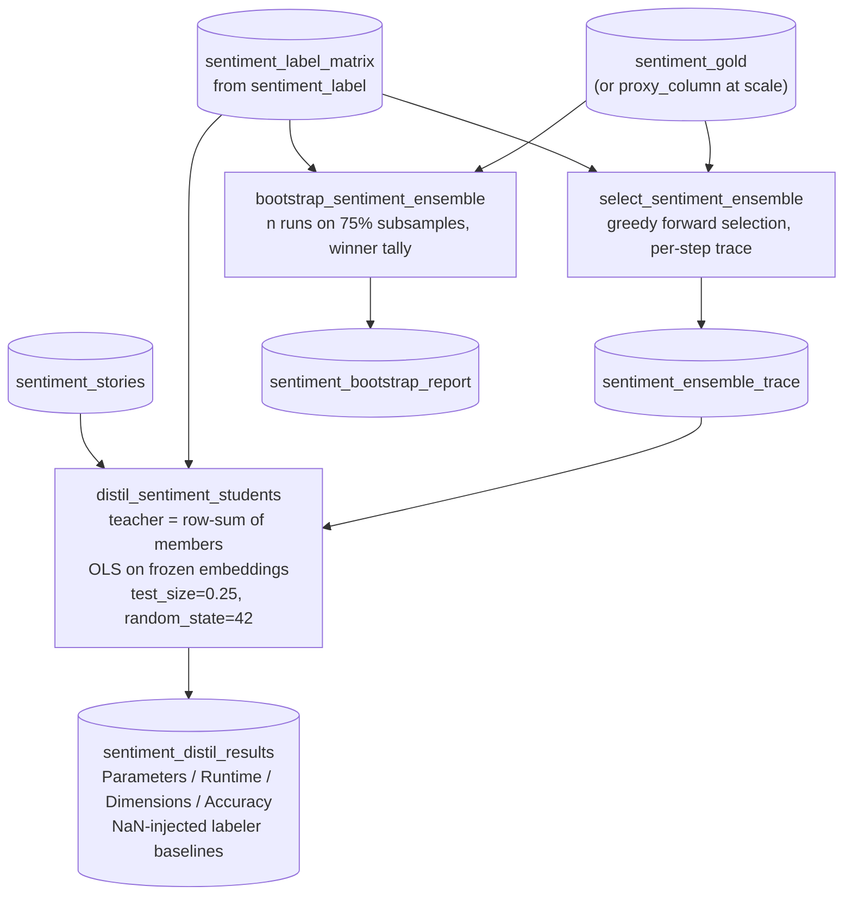

# `sentiment_distil` — ensemble the labelers, distil into OLS students

Blog ref: [ensemble-and-distil](https://nosible.com/blog/ensemble-and-distil) —
steps three and four of "Curate → Label → Ensemble → Distil → Scale": greedy
iterative-addition ensemble selection with a per-step trace, 1,000-run
bootstrap stability, a teacher that is the unweighted row-sum of the winning
members (±1 band), and `LinearRegression` students on frozen sentence
embeddings graded against the teacher. Local copy:
[`docs/blog-archive/ensemble-and-distil.md`](../../../../docs/blog-archive/ensemble-and-distil.md).

## Flow

## Not registered yet

The integration pass registers this pipeline (after `sentiment_label`) and adds
the three reporting catalog entries named in `pipeline.py`'s docstring.

## Offline behaviour

The default distil path embeds with the repo's deterministic hash provider —
the whole DAG runs with zero network. Setting `survey_checkpoints` to the
CPU-friendly list in `sentiment.distil.DEFAULT_SURVEY_CHECKPOINTS` reproduces
the post's sentence-transformer survey (each checkpoint is a download).
