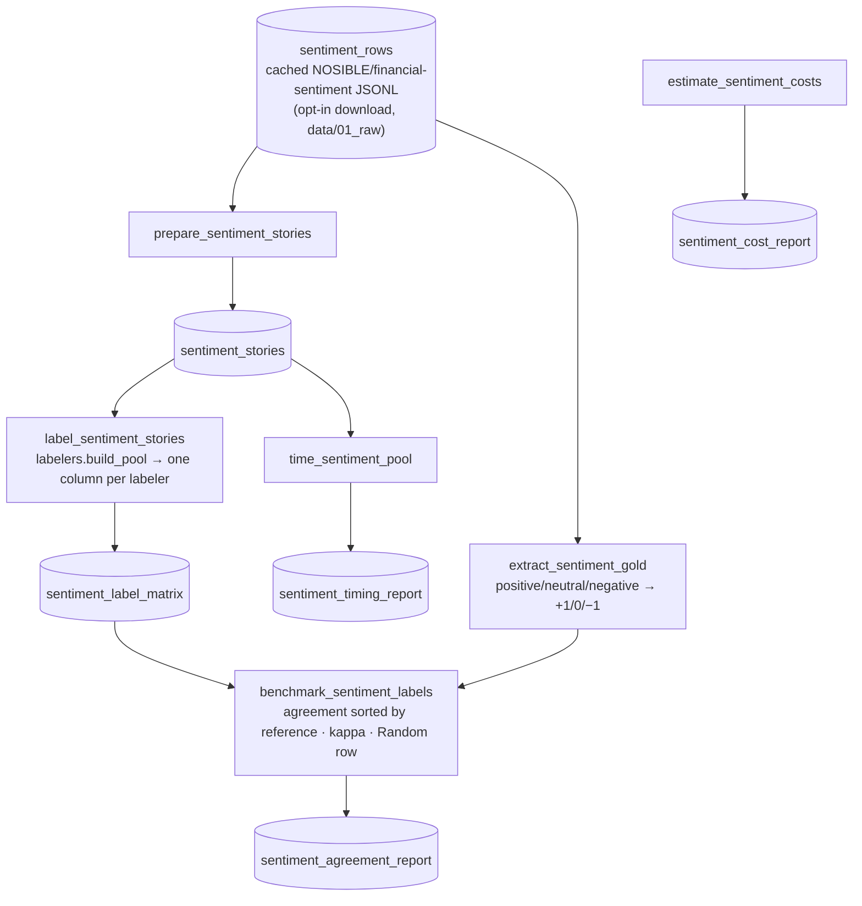

# `sentiment_label` — label a story set with the whole pool, then report

Blog ref: [news-sentiment-showdown-who-checks-vibes-best](https://nosible.com/blog/news-sentiment-showdown-who-checks-vibes-best) —
the post's method as a static DAG: curate a representative dataset, label it
with every model under one shared few-shot prompt, publish the agreement
matrices, the timing table, and the 10M-story cost extrapolation. Local copy:
[`docs/blog-archive/news-sentiment-showdown-who-checks-vibes-best.md`](../../../../docs/blog-archive/news-sentiment-showdown-who-checks-vibes-best.md).

## Flow

## Not registered yet

The integration pass registers this pipeline and adds the catalog entries and
parameter blocks listed in `pipeline.py`'s docstring; `configs/sentiment/labelers.yaml`
is the reference parameter block. Until then it runs through its node functions
directly (that is what the offline tests do).

## Offline behaviour

With the default parameters the pool is TextBlob + VADER + Random — zero
downloads, zero network. Flair / FinBERT / LLM columns are opt-in via the
parameter block and require their respective installs, downloads or API keys.
