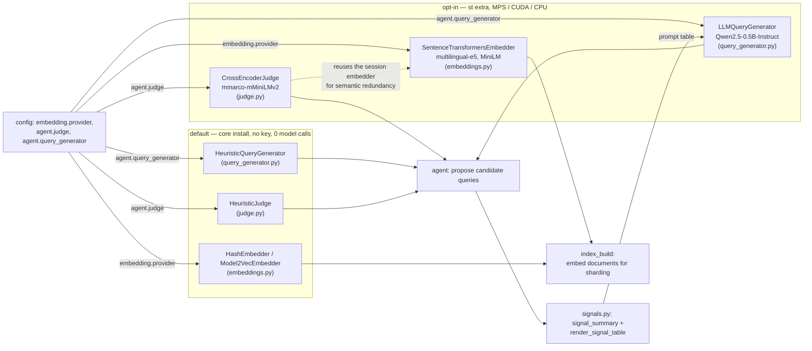

# `providers` — embeddings, judging and query generation behind protocols

Blog ref: https://nosible.com/blog/the-road-to-cybernaut-1 — stage 4 (instruction
tuning and embedding: the query and its expansions are embedded with
`intfloat/multilingual-e5-large-instruct`) and stage 5 (shard selection compares
that vector against shard-summary embeddings, so shard quality is bounded above by
embedding quality).

Blog ref: https://nosible.com/blog/introducing-cybernaut-1-agentic-search-with-mcts —
the agent's LLM components are shown the retriever's ranking signals rather than
prose alone. Local copy:
[reference copy](../../../data/00_reference/the-road-to-cybernaut-1.md).

Every provider sits behind a `Protocol` with one free, deterministic
implementation and one model-backed alternative. That is the point of the package:
the default install answers questions offline with **zero model calls**, and a
config change — not a code change — swaps in the real models.

## Which provider is which

- [`embeddings.py`](embeddings.py) — protocol `EmbeddingProvider`. Free defaults
  `HashEmbedder` (offline, byte-deterministic, no semantic structure) and
  `Model2VecEmbedder` (distilled static vectors, a core dependency, no torch).
  Model-backed: `SentenceTransformersEmbedder`, the quality ceiling. Selected by
  `embedding.provider`.
- [`judge.py`](judge.py) — protocol `Judge`. Free default `HeuristicJudge`:
  query-token-coverage relevance, unique question-token coverage, and mean
  pairwise title-Jaccard redundancy. Model-backed: `CrossEncoderJudge`. Selected
  by `agent.judge`.
- [`query_generator.py`](query_generator.py) — protocol `QueryGenerator`. Free
  default `HeuristicQueryGenerator`, five deterministic rewrite shapes.
  Model-backed: `LLMQueryGenerator`. Selected by `agent.query_generator`.
- [`signals.py`](signals.py) — no protocol, pure functions: a compact table and a
  flat aggregate over the per-hit score bundle.

## What the model-backed paths actually cost

- The cross-encoder judge and the LLM generator both need the optional `st` extra
  (torch). `create_judge` / `create_query_generator` raise a `ConfigError` naming
  the install command rather than failing at the first call.
- Both run on MPS on Apple silicon via `accel.resolve_device`, and both count
  their invocations (`calls`), so `AgentTrace.llm_calls` is honest.
- The cross-encoder judge scores `(question, title + body)` pairs — anchored to
  what the user asked, not to the agent's current rewrite — and reuses the
  session's embedder for semantic redundancy when one is supplied.
- `run_agent_search` gives Explore the *heuristic* judge whenever a model-backed
  judge is configured, and pays the cross-encoder only in Refine and Exploit:
  the cheap-wide / expensive-deep split that `use_model_judge` encodes.
- The generator's `temperature` is the annealing knob (1.0 → 0.6 → 0.3). `None`
  keeps greedy decoding; a set temperature switches to seeded sampling with
  `torch.manual_seed` re-applied per call, so annealed runs stay replayable.

## Signals: what the model is shown

`signal_summary(hits)` is the flat `dict[str, float]` passed to `Judge.score`, and
`render_signal_table(hits)` is the compact table `build_generator_prompt` inserts
into the LLM's user turn. The table carries BM25, dense, rerank and fused RRF per
hit, which is this repo's reading of the post's "high-trust" LLM components.
`signal_summary` is accepted by the `Judge` protocol but neither shipped judge
reads it yet; a document-level reranker wired into the reward would be the first
consumer.

## Read next

- [`agent/README.md`](../agent/README.md) — how these three providers are wired
  into a run, and the reward the judge feeds.
- [`../accel.py`](../accel.py) — device resolution and `device_fingerprint()`,
  the per-device determinism caveat for model-backed providers.
- [`../config.py`](../config.py) — `EmbeddingConfig` and `AgentConfig`, the
  fields named above.
