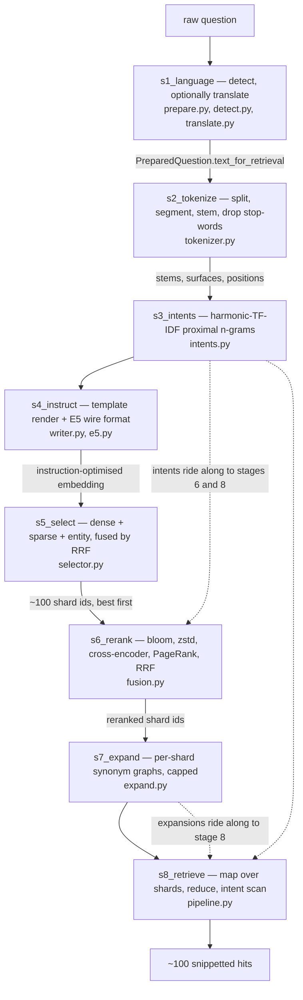

# `query` — the eight-stage Hybrid-3 query pipeline

Blog ref: [the-road-to-cybernaut-1](https://nosible.com/blog/the-road-to-cybernaut-1) —
"Every question that comes into NOSIBLE goes through a pretty sophisticated eight-stage
retrieval pipeline."
Local copy:
[`the-road-to-cybernaut-1.md`](../../../data/00_reference/the-road-to-cybernaut-1.md).

Each subpackage is one stage, named `s<N>_<verb>` so the post's numbering survives the
filesystem. The stages are deliberately independent: each consumes the previous stage's
output as plain values, so any one of them can be tested without loading the others.
Build-time concerns (sharding, index writing) live outside this package — these modules
run per *question*, not per corpus.

## The chain

## Key entry points

| File | Stage | Entry point |
|---|---|---|
| `__init__.py` | — | `STAGES`, the ordered subpackage names |
| `live.py` | 1, 2, 4 | `prepare()` and `live_query_tokens()`, wiring early stages into serving |
| `s1_language/prepare.py` | 1 | `prepare_question()` |
| `s2_tokenize/tokenizer.py` | 2 | `MultilingualTokenizer.tokenize()` |
| `s3_intents/intents.py` | 3 | `predict_intents()` |
| `s4_instruct/writer.py` | 4 | `InstructionSelector.select()` and `.embedding_input()` |
| `s5_select/selector.py` | 5 | `ShardSelector.select()` |
| `s6_rerank/fusion.py` | 6 | `rerank_index_shards()` |
| `s7_expand/expand.py` | 7 | `expand_terms()` and `expand_query()` |
| `s8_retrieve/pipeline.py` | 8 | `retrieve_map_reduce()` |

## Read next

- `docs/REVERSE_ENGINEERING_GUIDE.md` §1 — the authoritative stage-by-stage description
  with every parameter tagged `[disclosed]` or `[inferred]`.
- `data/00_reference/the-road-to-cybernaut-1.md` — the blog text these stages implement.
- `src/cybernaut_mini/query/live.py` — how stages 1, 2 and 4 reach the serving path.
- `src/cybernaut_mini/rrf.py` — the fusion primitive stages 5, 6 and 8 all share.
