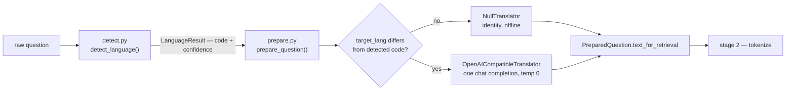

# `s1_language` — stage 1: language detection and translation

Blog ref: https://nosible.com/blog/the-road-to-cybernaut-1 — stage 1, "Language Detection
and Translation": `fasttext-langdetect` (170+ languages) for detection and
`gemma-3n-e4b-it` via OpenRouter (140 languages) for translation.
Local copy:
[`the-road-to-cybernaut-1.md`](../../../../data/00_reference/the-road-to-cybernaut-1.md).

This is the first thing a raw question meets and the only stage allowed to call an LLM
before retrieval begins. It answers two questions every later stage asks: *what language
is this?* and *what text should the rest of the pipeline search with?* Detection is
offline, deterministic and never raises; translation sits behind a protocol, so an
offline install still gets a language code and a `NullTranslator` identity path.

## Data flow

## Key files

| File | What it owns |
|---|---|
| `prepare.py` | `prepare_question()` — the whole of stage 1 as the pipeline sees it |
| `detect.py` | `detect_language()` — fastText `lid.176`, degrades to `UNKNOWN_LANGUAGE` |
| `translate.py` | `Translator`, `NullTranslator`, `OpenAICompatibleTranslator`, `language_name()` |
| `__init__.py` | the advertised surface, re-exported for callers |

## Read next

- `../s2_tokenize/README.md` — the consumer of `PreparedQuestion.text_for_retrieval`.
- `../live.py` — the serving-path glue that runs `prepare()` before every entry point.
- `../s4_instruct/README.md` — where the detected language name fills E5's placeholder.
