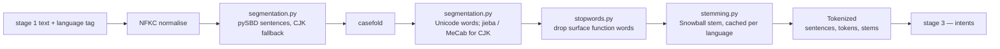

# `s2_tokenize` — stage 2: multilingual tokenization

Blog ref: https://nosible.com/blog/the-road-to-cybernaut-1 — stage 2, "Multilingual
Tokenization": sentence boundary detection, text segmentation, inflection, Unicode
normalization, stemming and stop-word removal behind "a standardized interface that wraps
probably a dozen or more different NLP packages".
Local copy:
[`the-road-to-cybernaut-1.md`](../../../../data/00_reference/the-road-to-cybernaut-1.md).

One class, one method, every language. The language-specific machinery (pySBD, jieba,
MeCab, PyStemmer) is selected underneath and never exposed. The post's worked example is
the acceptance test: "What lessons from bacteria and yeast actually translate into safer
gene-editing medicines?" must yield exactly nine stems, with `gene` and `edit` split on
the hyphen.

## Data flow

## Key files

| File | What it owns |
|---|---|
| `tokenizer.py` | `MultilingualTokenizer` and `Tokenized` — the single advertised interface |
| `segmentation.py` | sentence splitting and cross-script word segmentation |
| `stemming.py` | Snowball stemming with a per-language cache; identity elsewhere |
| `stopwords.py` | per-language stop-word frozensets; empty set for unshipped languages |
| `languages.py` | `normalize_language()` and script-based language guessing |
| `__init__.py` | `tokenize()` over a shared default tokenizer (documented not thread-safe) |

## Read next

- `../s3_intents/README.md` — consumes `Tokenized.stems` plus positions.
- `../live.py` — where stage 2 takes over from the ASCII-only build-time processor.
- `../../../cybernaut_mini/text.py` — the build-time tokenizer the BM25 index was built
  from, and the reason stage 2 only handles what that regex would delete.
