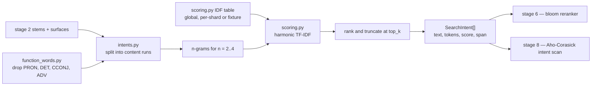

# `s3_intents` — stage 3: search-intent prediction

Blog ref: https://nosible.com/blog/the-road-to-cybernaut-1 — stage 3, "Search Intent
Prediction": a search intent is "a sequence of proximal tokens that have a high 'harmonic
TF-IDF score' and do not contain certain parts-of-speech like, for example, pronouns,
determiners, conjunctions, adverbs".
Local copy:
[`the-road-to-cybernaut-1.md`](../../../../data/00_reference/the-road-to-cybernaut-1.md).

An intent is a contiguous run of content tokens, scored by the harmonic mean of its
members' TF-IDF, so one common word sinks a whole phrase. The post prints the six intents
for its worked question; `intents.py` reproduces that example exactly. Intents are not
just decoration: stage 6 tests them against each shard's phrase bloom filter and stage 8
matches them with Aho-Corasick inside retrieved documents.

## Data flow

## Key files

| File | What it owns |
|---|---|
| `intents.py` | `predict_intents()` and `extract_intents()` — the ranked intent list |
| `scoring.py` | `compute_idf()`, `query_tfidf()`, `harmonic_tfidf()`, `resolve_idf()` |
| `function_words.py` | curated closed-class list (default) and the optional spaCy POS detector |
| `tokens.py` | `tokenize_query()`, `QueryToken`, `singularize()`, `spacy_available()` |
| `__init__.py` | re-exports the four concerns as one stage surface |

## Read next

- `../s6_rerank/README.md` — the bloom reranker's downrank rule on an intent-free shard.
- `../s8_retrieve/README.md` — the Aho-Corasick scan and how a match reranks results.
- `../../../cybernaut_mini/rrf.py` — the fusion primitive the intent list joins in stage 8.
