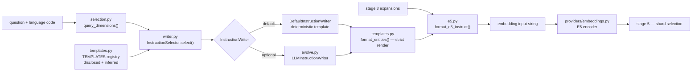

# `s4_instruct` — stage 4: instruction templates and embedding input

Blog ref: https://nosible.com/blog/the-road-to-cybernaut-1 — stage 4, "Instruction Tuning
and Embedding": generate an instruction for the question, submit it with the expansions to
`intfloat/multilingual-e5-large-instruct`, and take the "free 1-5% improvement in search
precision and recall". The post discloses one template verbatim and says an LLM evolved
them.
Local copy:
[`the-road-to-cybernaut-1.md`](../../../../data/00_reference/the-road-to-cybernaut-1.md).

This package is the *instruction* half of stage 4 only. It renders the template, chooses a
template deterministically, and composes E5's exact `Instruct: …\nQuery: …` wire format.
Nothing here loads a model or opens a socket; the encoders live in
`cybernaut_mini.providers.embeddings`.

## Data flow

## Key files

| File | What it owns |
|---|---|
| `templates.py` | `TEMPLATES`, the disclosed template, `Provenance`, the strict renderer |
| `selection.py` | `query_dimensions()` and `select_template()` — deterministic template choice |
| `writer.py` | `InstructionSelector` and the `InstructionWriter` protocol (the entry point) |
| `e5.py` | `format_e5_instruct()`, `compose_query()`, the E5 wire format |
| `evolve.py` | `LLMInstructionWriter` and `evolve_template()` — the post's LLM half, opt-in |
| `__init__.py` | the advertised surface, re-exported for callers |

## Read next

- `../s5_select/README.md` — the consumer of the instruction-optimised embedding.
- `../live.py` — composes the instruct wire format only for `e5`+`instruct` checkpoints.
- `../../../cybernaut_mini/providers/embeddings.py` — the encoder that consumes the string.
