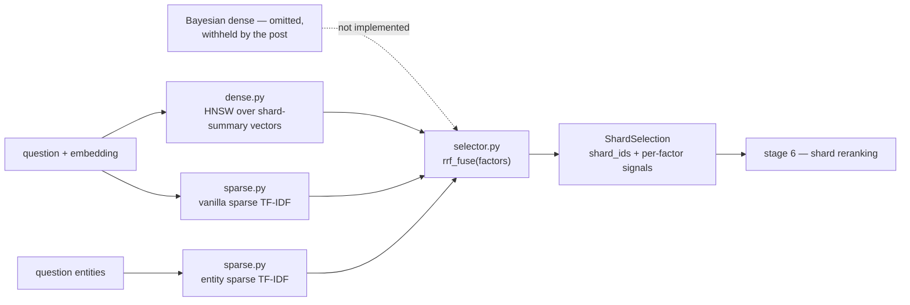

# `s5_select` — stage 5: shard selection

Blog ref: https://nosible.com/blog/the-road-to-cybernaut-1 — stage 5, "Shard Selection":
"arguably the single most important stage in our retrieval pipeline because, if we route
the question to the wrong shards, we won't return the best document". Four ranking factors
fused with reciprocal rank fusion.
Local copy:
[`the-road-to-cybernaut-1.md`](../../../../data/00_reference/the-road-to-cybernaut-1.md).

This stage decides which shards are worth opening at all. It reads shard *manifests* only —
never documents or token matrices — because the point is to decide what not to open. Three
of the post's four factors ship here: vanilla dense over an HNSW graph, vanilla sparse
TF-IDF, and entity sparse. The Bayesian dense factor is withheld by the post for a patent
and is deliberately absent, recorded in `ShardSelectionSignals.omitted_factors`.

## Data flow

## Key files

| File | What it owns |
|---|---|
| `selector.py` | `ShardSelector.select()` — the entry point; fuses factors with `rrf_fuse` |
| `dense.py` | `HnswShardIndex`, `summary_vectors()`, and a recall report against exact cosine |
| `sparse.py` | `SparseShardMatrix` over shard keywords and over shard entities |
| `__init__.py` | factor names (`DENSE`, `SPARSE`, `ENTITY`, `BAYESIAN_DENSE`) and exports |

## Read next

- `../s6_rerank/README.md` — how the ~100 selected shards are reordered.
- `../s7_expand/README.md` — expansion draws on the per-shard graphs of these shards.
- `../../../cybernaut_mini/rrf.py` — the fusion primitive, and
  `../../../cybernaut_mini/routing.py`, the fused stage-5+6 router this stage supersedes.
