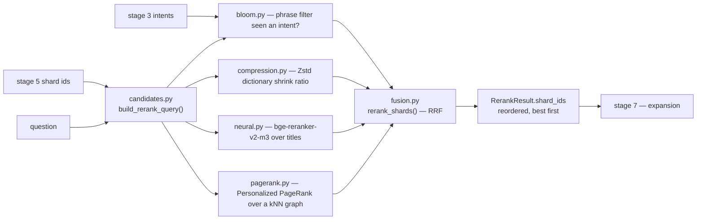

# `s6_rerank` — stage 6: shard reranking

Blog ref: https://nosible.com/blog/the-road-to-cybernaut-1 — stage 6, "Shard Reranking",
with the worked example in which the shards stage 5 selected for the Japanese question
were "quite bad" until reranking reordered them. Four rerankers fused with reciprocal rank
fusion over `zstandard` and `rBloom` artifacts.
Local copy:
[`the-road-to-cybernaut-1.md`](../../../../data/00_reference/the-road-to-cybernaut-1.md).

Stage 5 ranks shards by centroid similarity; stage 6 reorders that selection by estimating
actual relevance, so good shards rise and irrelevant ones sink. It is the first consumer of
`cybernaut_mini.shard_artifacts`. LLM reranking is deliberately not implemented — the post
found it works "but the added latency is simply too high for a search engine".

## Data flow

## Key files

| File | What it owns |
|---|---|
| `fusion.py` | `rerank_index_shards()` — the entry point; `default_rerankers()`, `RerankResult` |
| `bloom.py` | `BloomReranker` — downranks shards whose phrase filter never saw the intents |
| `compression.py` | `CompressionReranker` — compression as similarity, over Zstd dictionaries |
| `neural.py` | `NeuralReranker` — optional cross-encoder, needs the `st` extra, not default |
| `pagerank.py` | `PageRankReranker`, `build_shard_knn_graph()`, `restart_distribution()` |
| `base.py` | `ShardReranker` protocol, `RerankQuery`, `ShardCandidate`, `rank_by_score()` |
| `candidates.py` | adapts index manifests into the rerankers' candidate records |

## Read next

- `../s7_expand/README.md` — consumes the reranked shard order.
- `../s8_retrieve/README.md` — broadcasts to the head of this order.
- `../../../cybernaut_mini/shard_artifacts.py` — the bloom filters and Zstd dictionaries
  that make this stage possible.
