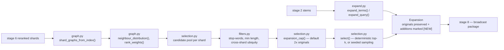

# `s7_expand` — stage 7: shard-based question expansion

Blog ref: https://nosible.com/blog/the-road-to-cybernaut-1 — stage 7, "Shard-based
Question Expansion": "we use the synonym graphs in each shard to probabilistically expand
our search terms … 'gene' in shard 11,343 only has the genetic meaning … we are very
careful not to overwhelm the original search words."
Local copy:
[`the-road-to-cybernaut-1.md`](../../../../data/00_reference/the-road-to-cybernaut-1.md).

Expansion happens *per shard*, which is what removes the ambiguity: the same token in a
genetics shard and a film shard draws different neighbours, so "gene" never picks up
"Willy Wonka" here. Original terms always survive and additions are marked `[NEW]`, and the
number of additions is capped as a ratio of the original count.

## Data flow

## Key files

| File | What it owns |
|---|---|
| `expand.py` | `expand_terms()` and `expand_query()`; `Expansion`, `ExpansionConfig` |
| `graph.py` | `ShardGraph`, `TermGraph`, `neighbour_distribution()`, `shard_graphs_from_index()` |
| `filters.py` | `TermFilter`, `UbiquityFilter` — rejects stop-words and corpus-wide terms |
| `selection.py` | `select()`, `expansion_cap()` — deterministic top-k or seeded sampling |
| `question.py` | `expand_question()`, `question_terms()` — the bridge from a raw question |
| `__init__.py` | the advertised surface, re-exported for callers |

## Read next

- `../s8_retrieve/README.md` — expansion terms ride in the broadcast package.
- `../s6_rerank/README.md` — the shard order that decides which graphs are consulted.
- `../../../cybernaut_mini/expansion.py` — the earlier single-function expander whose
  instincts (shard weighting, ubiquity filter) this stage preserves.
