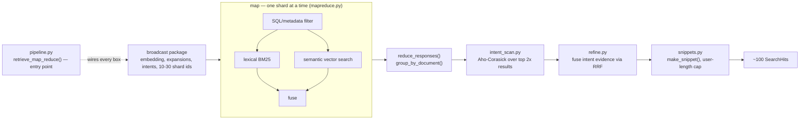

# `s8_retrieve` — stage 8: map-reduce retrieval

Blog ref: https://nosible.com/blog/the-road-to-cybernaut-1 — stage 8, "Retrieval Using
Map-Reduce": the package of "instruction-optimized embeddings … expanded set of search
terms … search intents … a list of 10-30 shards" is broadcast to each shard, which filters,
searches lexically, searches semantically and fuses; the results come back and about 100
are returned.
Local copy:
[`the-road-to-cybernaut-1.md`](../../../../data/00_reference/the-road-to-cybernaut-1.md).

Steps 1-4 are the disclosed pipeline already implemented in `cybernaut_mini.retrieval`,
which this package calls rather than duplicates. Step 5 — the full-text scan of top results
for stage-3 intents — is what makes the intent objects do work at query time. Fusion runs
on the reduce side by default so that RRF ranks stay comparable across shards; a match
reranks, it never filters.

## Data flow

## Key files

| File | What it owns |
|---|---|
| `pipeline.py` | `retrieve_map_reduce()` and `build_request()` — the entry point |
| `mapreduce.py` | `broadcast()`, `map_shard()`, `reduce_responses()`, `group_by_document()` |
| `intent_scan.py` | `IntentMatcher`, `IntentScan`, `intent_patterns()`, `fold()` |
| `refine.py` | `refine_with_intents()` — how an intent match changes the ranking |
| `snippets.py` | `make_snippet()` — builds user-length snippets around the match |
| `__init__.py` | the advertised surface; note it is a real module, not a pure re-export |

## Read next

- `../s3_intents/README.md` — the intents this stage scans for.
- `../s7_expand/README.md` — the expansions carried in the broadcast package.
- `../../../cybernaut_mini/retrieval.py` — steps 1-4, reused rather than reimplemented.
