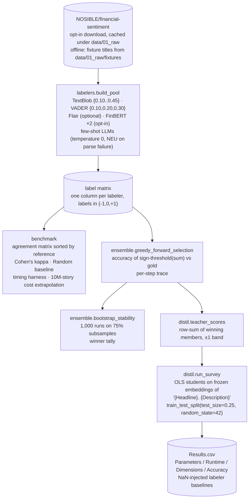

# `sentiment` — labeler pool, benchmark, ensemble-and-distil

Blog refs:
[news-sentiment-showdown-who-checks-vibes-best](https://nosible.com/blog/news-sentiment-showdown-who-checks-vibes-best)
(the labeler pool, the verbatim nine-example few-shot prompt, the agreement
matrices, the timing and cost findings) and
[ensemble-and-distil](https://nosible.com/blog/ensemble-and-distil) (greedy
iterative-addition ensembles, 1,000-run bootstrap stability, OLS students on
frozen sentence embeddings, the four-column `Results.csv`). Local copies:
[`docs/blog-archive/news-sentiment-showdown-who-checks-vibes-best.md`](../../../docs/blog-archive/news-sentiment-showdown-who-checks-vibes-best.md),
[`docs/blog-archive/ensemble-and-distil.md`](../../../docs/blog-archive/ensemble-and-distil.md).

## Flow

## Module map

| Module | Post concept |
|---|---|
| `labelers.py` | One column per labeler behind one protocol; the verbatim few-shot prompt (canonical copy: `configs/sentiment/few_shot_prompt.txt`). |
| `benchmark.py` | Pairwise agreement sorted by a reference column (human gold or proxy gold), Cohen's kappa, the Random row, the "339x" timing harness, hypothetical 10M-story costs. |
| `ensemble.py` | Iterative addition with the published per-step trace; 1,000-run bootstrap over 75% row subsamples. |
| `distil.py` | Teacher = unweighted row-sum with the inclusive ±1 band; `LinearRegression` students on frozen embeddings; the exact `Results.csv` schema with NaN baseline injection. |
| `data.py` | Opt-in NOSIBLE/financial-sentiment loader (canonical-JSONL cache) and offline fixture stories. |

## Offline defaults

Lexicon labelers (TextBlob, VADER) and every ensemble/distil computation run
with zero network. Flair is an optional import; FinBERT, sentence-transformer
survey checkpoints, and the HF dataset are opt-in downloads gated behind
`CYBERNAUT_MINI_SENTIMENT_DOWNLOADS=1`. The offline survey path reuses the
repo's hash embedding provider through `ProviderSurveyEncoder`.

## Pipelines

Static DAGs live in `pipelines/sentiment_label/` and
`pipelines/sentiment_distil/` (not yet registered; see those READMEs).
