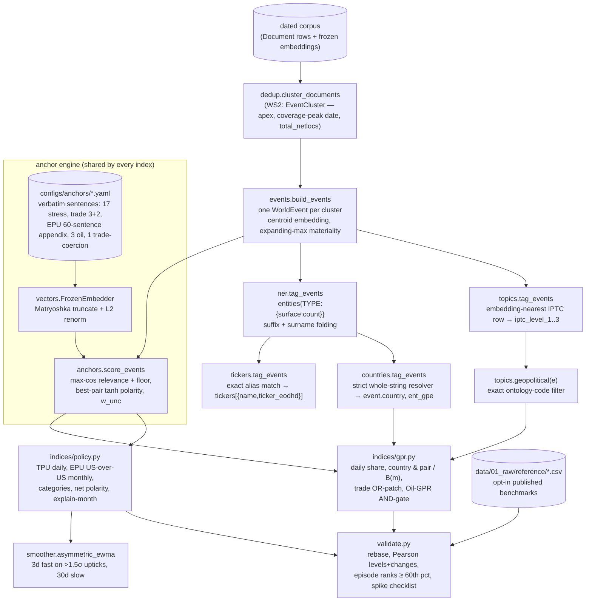

# `world` — the WORLD pillar: event store, tag layers, anchor engine, indices

Blog refs: [rebuilding-the-geopolitical-risk-index-from-nosible-world](https://nosible.com/blog/rebuilding-the-geopolitical-risk-index-from-nosible-world),
[an-embedding-based-approach-to-trade-and-economic-policy-uncertainty](https://nosible.com/blog/an-embedding-based-approach-to-trade-and-economic-policy-uncertainty),
[turning-news-into-a-risk-on-risk-off-equity-signal](https://nosible.com/blog/turning-news-into-a-risk-on-risk-off-equity-signal),
[point-in-time-knowledge-graphs-over-named-entities](https://nosible.com/blog/point-in-time-knowledge-graphs-over-named-entities).
Local copies under [`docs/blog-archive/`](../../../docs/blog-archive/).

Where the SEARCH pillar answers questions over documents, the WORLD pillar turns
de-duplicated news **events** into point-in-time risk and uncertainty series. One
real event is one record, no matter how many outlets repeat it; every field is
point-in-time safe (nothing encodes future information — the materiality
normalizer uses an *expanding* max, the denominators are *trailing* means, the
smoother's trigger statistics are strictly-before).

## Dataflow

## Point-in-time rules

| Field / series | Rule that keeps it causal |
| --- | --- |
| `materiality_score` | expanding max in date order, never corpus-wide |
| `B(m)` denominator | trailing 12-month mean, global, `min_periods=6` |
| daily detrend | trailing-365d mean of zero-filled daily breadth |
| smoother trigger | mean/std of changes strictly *before* the day (no look-ahead) |
| embedder | frozen, revision-pinned, never fine-tuned on the corpus |

## Thresholds are data

Published floors (0.35 trade/EPU, 0.40 trade-coercion, 0.30 stress/oil, 0.25
category, temperature 0.1) were tuned on `text-embedding-3-large` cosines and live
in the YAML configs. Open-model users sweep them (`anchors.sweep_relevance_floor`)
against the four polarity-separation stats (`anchors.polarity_separation`): the
posts' targets are off-topic mean w_unc ≈ 0.44, on-topic ≈ 0.63, 60% > 0.6,
21% < 0.4.
