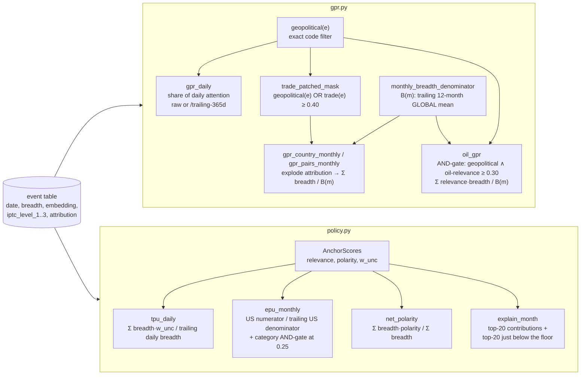

# `world.indices` — the GPR and TPU/EPU index families

Blog refs: [rebuilding-the-geopolitical-risk-index-from-nosible-world](https://nosible.com/blog/rebuilding-the-geopolitical-risk-index-from-nosible-world),
[an-embedding-based-approach-to-trade-and-economic-policy-uncertainty](https://nosible.com/blog/an-embedding-based-approach-to-trade-and-economic-policy-uncertainty).
Local copies under [`docs/blog-archive/`](../../../../docs/blog-archive/).

Every index is a group-by over the event table: a numerator of breadth
(`total_netlocs`, optionally tilted by `w_unc` or oil relevance), a
corpus-growth-stripping trailing denominator, and a mask built from the topic
filter and/or the anchor engine.

Design invariants the tests pin:

- `B(m)` is **global**: `per_country_denominator` exists only to demonstrate the
  self-cancellation the post warns about.
- The trade OR-patch leaves conflict-country series **bit-identical** — only
  events that were previously excluded can enter.
- Oil is an **AND**-gate (geopolitical ∧ relevance), weighted by
  `relevance × breadth`, never plain breadth.
- EPU is US-over-US on **both** lines, "the way the published index scales US
  articles by US articles".
- Lever ablations (the 9-vs-10-lever COVID gap) are a parameter upstream
  (`EmbeddedAnchorSet.embed(..., levers=...)`), not logic here.
