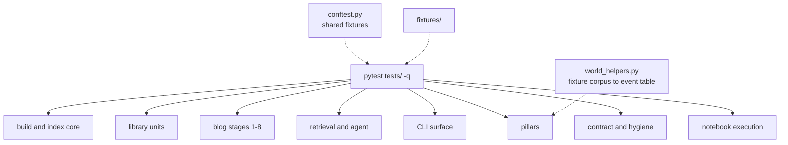

# `tests/` — the offline test suite

Blog ref: [the-road-to-cybernaut-1](https://nosible.com/blog/the-road-to-cybernaut-1).
Test module names mirror the pipeline: `test_s1_language.py` … `test_s8_retrieve.py`
are the eight blog stages, and the remaining modules cover the build, the CLI, and the
three pillar sub-systems (entities, sentiment, WORLD). Local copy:
[`data/00_reference/the-road-to-cybernaut-1.md`](../data/00_reference/the-road-to-cybernaut-1.md).

The whole suite runs offline. There is no network call in the default path, no
synthetic corpus, and no fabricated judgment: relevance tests use the committed
MIRACL fixture in `data/01_raw/fixtures/`.



## Test areas

- **Build and index core** — `test_build.py`, `test_ingest.py`, `test_sharding.py`,
  `test_models.py`, `test_storage.py`, `test_index_scale.py`, `test_shard_artifacts.py`,
  `test_term_graph.py`, `test_lsh.py`, `test_reproducibility.py`.
- **Library units** — `test_datasets.py`, `test_config.py`, `test_evals.py`,
  `test_embeddings.py`, `test_text.py`, `test_trace.py`, `test_rrf.py`,
  `test_dedup.py`.
- **Blog stages 1-8** — `test_s1_language.py`, `test_s2_tokenize.py`,
  `test_s3_intents.py`, `test_s4_instruct.py`, `test_s4_evolve.py`, `test_s5_select.py`,
  `test_s7_expand.py`, `test_s8_retrieve.py`, `test_query_live.py`, `test_corpus.py`.
- **Retrieval and agent** — `test_retrieval.py`, `test_routing.py`,
  `test_agent_search.py`, `test_agent_schedule.py`, `test_expansion.py`,
  `test_policy.py`, `test_providers.py`.
- **CLI surface** — `test_cli_search.py`, `test_cli_agent.py`,
  `test_cli_integration.py`.
- **Pillars** — `test_entities_*.py` (9 modules), `test_sentiment_*.py` (12),
  `test_world_*.py` (5).
- **Contract and hygiene** — `test_docs_check.py`, `test_hygiene.py`, `test_accel.py`,
  `test_curriculum.py`.
- **Notebooks** — `test_notebooks.py`, described below.

## `conftest.py`

The shared fixture layer, imported by every module in this directory.

- `text_processor` — `TextProcessor(use_spacy=False)`, pinning the regex backend so a
  machine with `en_core_web_sm` installed gives the same result as one without.
- `hash_embedder` — `HashEmbedder(dim=64)`, deterministic and download-free.
- `built_index_path` / `built_index` — a session-scoped index built once from a
  planted 24-document `_CORPUS` (a rare-token lexical target, a paraphrase-only dense
  target, and category clusters), written to a `tmp_path_factory` directory.
- `sample_documents` — a small in-memory document set for unit tests that do not need
  a built index.

The planted corpus is deliberately not the fixture slice: it isolates lexical and
dense behaviour with known answers, while the fixture slice supplies realistic
retrieval and evaluation input.

## `world_helpers.py`

Builds the object every `test_world_*.py` needs: the tagged WORLD event table over
the committed CC-News fixture, clustered with `dedup.cluster_documents` and tagged by
`world.ner`, `world.tickers` and `world.countries`. The result is `lru_cache`d per
process, and the embeddings come from `artifacts/fixture/embeddings.npy`, so the
anchor and topic vectors live in the same frozen hash-256 space as the stored event
vectors. Nothing here invents data — clustering and tagging are the code under test.

## `fixtures/`

Small, test-local fixtures that do not belong in the protected `data/` tree. The
`edgar/` subdirectory is currently empty; the real cached EDGAR excerpt the entity
tests exercise lives in `data/01_raw/edgar/`.

## `test_notebooks.py`

Executes every notebook in `notebooks/` end to end against the real Kedro catalog,
one test per notebook, in a fresh kernel with a 600 s timeout. It enforces four
things a notebook otherwise rots out of:

1. every notebook is discovered — an empty glob fails loudly rather than passing;
2. every notebook executes without a cell error;
3. every notebook carries a `mermaid` block and reads data through `catalog.load`,
   never by opening a `data/` or `artifacts/` path directly;
4. every notebook is committed with outputs cleared and is listed in
   `notebooks/README.md`.

`CYBERNAUT_LIVE_API` is deleted from the environment before each run, so an ambient
key in the devcontainer cannot turn a test into a billable API call. `make notebooks`
runs this module alone.

## How to use it

```bash
make test                      # uv run pytest, the whole suite
uv run pytest tests/test_rrf.py -q          # one module
uv run pytest tests/test_build.py -q -k shard   # one behaviour
uv run pytest tests/test_notebooks.py -q    # notebook execution only
```

Add a module next to the sub-system it covers and reuse the `conftest.py` fixtures
rather than rebuilding an index or an embedder inside the test. Anything that needs
real documents should read `data/01_raw/fixtures/` and attribute them through
`data/ATTRIBUTION.md`; do not add a synthetic corpus.
