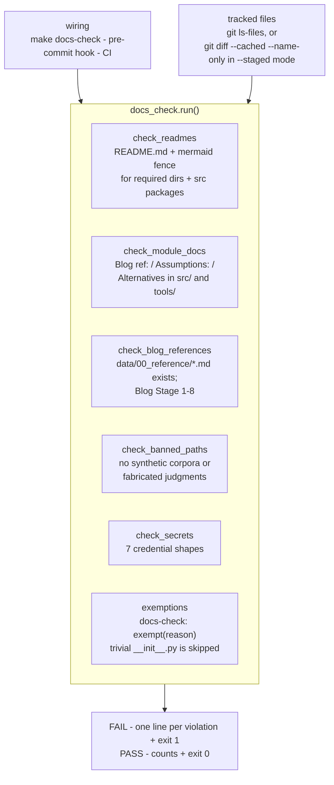

# `tools/` — the executable documentation contract

Blog ref: [the-road-to-cybernaut-1](https://nosible.com/blog/the-road-to-cybernaut-1)
(whole-repo policy, not one stage). This repository's purpose is to teach the
architecture in that post, so the prose convention — every module cites the blog, its
assumptions, and its rejected alternatives — is enforced by a program instead of
trusted to memory. Local copy:
[`data/00_reference/the-road-to-cybernaut-1.md`](../data/00_reference/the-road-to-cybernaut-1.md).

The directory holds one file: **`docs_check.py`**. It is the only tool here on
purpose — a checker that is easy to read is the teaching artifact, and a second
script would split the contract across two places.

## What `docs_check.py` checks

| Check | Rule |
|---|---|
| `readme-present` | Every required directory and every `src/` package has a `README.md` |
| `readme-mermaid` | That README contains a ```` ```mermaid ```` fence |
| `module-docstring` | `Blog ref:`, `Assumptions:` and `Alternatives` in each module docstring |
| `blog-reference` | Cited `data/00_reference/*.md` files exist; stages are 1–8 |
| `no-dummy-data` | No synthetic corpus or fabricated judgment is tracked |
| `secret-scan` | Seven credential shapes never reach a tracked file |

The required README directories are `.`, `configs`, `data`, `docs`, `notebooks`,
`scripts`, `tests` and `tools`, plus every directory under `src/` that holds an
`__init__.py`. The `mermaid` fence is required because it is the only diagram form
GitHub renders natively. For `module-docstring`, a trivial `__init__.py` (under 400
characters) is skipped, and any module may opt out explicitly with
`docs-check: exempt(reason)`. The `no-dummy-data` ban list is currently empty because
the old synthetic corpus was deleted and replaced by the real fixture slice; the check
stays wired so a synthetic corpus cannot quietly return. The seven credential shapes
are NOSIBLE, OpenAI, Anthropic, GitHub, AWS, Hugging Face and PEM private keys.



Two behaviours are easy to get wrong when reading it:

- **README coverage is whole-repo even under `--staged`.** Deleting a README in a
  directory this commit does not touch still fails, because coverage is a property of
  the repository, not of the diff.
- **The checks are textual, not semantic.** The script proves a module *claims* a blog
  reference; only a reviewer can prove the claim is true. `tools/docs_check.py` is
  itself exempt from the blog-path scan, because its own docstrings use example paths
  to explain what the scan catches.

## Why it is stdlib-only

`docs_check.py` imports only `argparse`, `ast`, `re`, `subprocess`, `sys`, `dataclasses`
and `pathlib`. It runs from the tracked git pre-commit hook
(`scripts/git-hooks/pre-commit`, installed by `scripts/install_hooks.sh`) and from CI
(`.github/workflows/ci.yml`). A hook that needs `uv sync` before it can run is a hook
people disable, so third-party imports — and a `pyyaml`-based config check, an
`interrogate`-style docstring parser, or a `detect-secrets` dependency — are
deliberately avoided.

## How to run it

```bash
make docs-check                        # whole repo
python3 tools/docs_check.py            # same thing, no virtualenv needed
python3 tools/docs_check.py --staged   # only files staged for commit (hook mode)
python3 tools/docs_check.py --summary  # counts only, no per-violation detail
```

Exit code is 0 when clean and 1 when any check fails. `make check` runs it alongside
lint, typecheck and tests. Adding a package directory means adding its `README.md` in
the same commit; the contract itself is defined in `AGENTS.md`.
